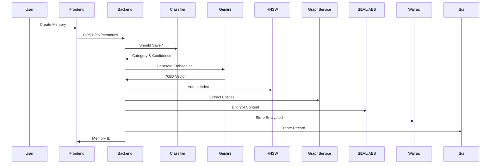
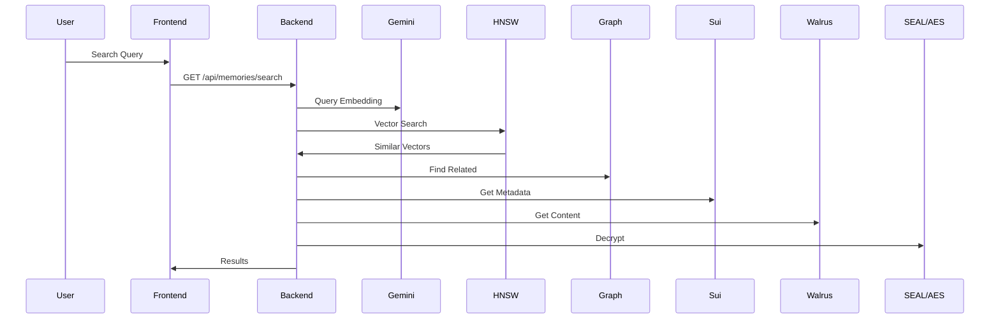

# Personal Data Wallet - Complete Project Documentation

## Table of Contents
1. [Executive Summary](#executive-summary)
2. [Architecture Overview](#architecture-overview)
3. [Technology Stack](#technology-stack)
4. [Core Features](#core-features)
5. [System Components](#system-components)
6. [Data Flow](#data-flow)
7. [Security Model](#security-model)
8. [Deployment Architecture](#deployment-architecture)
9. [Development Workflow](#development-workflow)
10. [API Documentation](#api-documentation)
11. [Future Roadmap](#future-roadmap)

---

## Executive Summary

Personal Data Wallet is a cutting-edge decentralized application that combines blockchain technology, AI-powered memory management, and advanced encryption to create a secure, intelligent personal data management system. Built on the SEAL branch with Identity-Based Encryption (IBE), the application enables users to:

- **Store and retrieve memories** using semantic search and vector embeddings
- **Maintain encrypted chat sessions** with AI assistance  
- **Control data access** through advanced blockchain-based permissions (allowlists, timelocks, roles)
- **Build knowledge graphs** from personal information
- **Search memories intelligently** using HNSW vector indices
- **Manage sessions** with cryptographic session keys and time-limited access

### Key Innovation Points
- **Hybrid Storage Model**: Critical data on Sui blockchain, operational data in PostgreSQL
- **AI-Enhanced Retrieval**: Semantic search with graph-based expansion using Gemini embeddings
- **Decentralized Encryption**: SEAL SDK with IBE, threshold cryptography, and session key management
- **Real-time Processing**: Streaming chat with memory context injection
- **Advanced Access Control**: App allowlists, time-locked access, and role-based permissions
- **Multimodal Support**: Text, images, and PDF processing with unified embeddings

---

## Architecture Overview

```
┌──────────────────────────────────────────────────────────────┐
│                     User Interface (Next.js)                  │
├──────────────────────────────────────────────────────────────┤
│                         API Gateway                           │
├──────────────────────────────────────────────────────────────┤
│                    Backend Services (NestJS)                  │
├────────────────┬──────────────┬─────────────┬────────────────┤
│  Memory Layer  │  Chat Layer  │  AI Layer   │ Storage Layer  │
├────────────────┴──────────────┴─────────────┴────────────────┤
│                    Infrastructure Services                     │
├──────────────────────────┬────────────────────────────────────┤
│    Blockchain (Sui)      │        Storage (Walrus)            │
├──────────────────────────┼────────────────────────────────────┤
│    PostgreSQL (Chat)     │    SEAL Key Servers (Encryption)   │
└──────────────────────────┴────────────────────────────────────┘
```

### Architectural Principles
1. **Separation of Concerns**: Modular design with clear boundaries
2. **Scalability First**: Horizontal scaling capabilities built-in
3. **Privacy by Design**: End-to-end encryption with decentralized key management
4. **Performance Optimized**: Caching, batching, and async processing
5. **Blockchain Hybrid**: On-chain for critical data, off-chain for operational data

---

## Technology Stack

### Frontend
- **Framework**: Next.js 14 (App Router)
- **Language**: TypeScript
- **UI Library**: Mantine UI
- **Styling**: TailwindCSS
- **State Management**: React Query (TanStack Query)
- **Blockchain Integration**: 
  - @mysten/dapp-kit
  - @suiet/wallet-kit

### Backend
- **Framework**: NestJS 11
- **Language**: TypeScript 5.7
- **Database**: PostgreSQL (chat sessions only)
- **Real-time**: Server-Sent Events (SSE)
- **Testing**: Jest
- **Key Libraries**:
  - @mysten/seal: 0.5.2+ (IBE encryption)
  - @mysten/sui: 1.37.6 (blockchain interaction)
  - @mysten/walrus: 0.6.4 (Quilt batching support)
  - hnswlib-node: 3.0.0 (vector search)
  - @google/generative-ai: 0.24.1 (Gemini AI)

### AI & Machine Learning
- **LLM Provider**: Google Gemini
  - Models: gemini-2.0-flash (chat), gemini-1.5-flash (classification)
  - Embeddings: embedding-001 (768 dimensions)
- **Vector Search**: HNSW (Hierarchical Navigable Small World)
  - Library: hnswlib-node 3.0.0
  - Distance Metric: Cosine similarity
  - Index Management: Batch updates with 5s delay or 50 vector threshold
- **Knowledge Graph**: Custom implementation with entity extraction and relationship traversal

### Blockchain & Storage
- **Blockchain**: Sui Network
  - Smart Contracts: Move language
  - Network: Mainnet/Testnet/Devnet
- **Decentralized Storage**: Walrus
  - Content-addressed storage
  - Persistent blob storage
  - Quilt batching: Up to 660 files per batch (420x cost savings for 10KB files)
  - Aggregator network for HTTP access
- **Encryption** (Current SEAL Branch):
  - Identity-Based Encryption via @mysten/seal SDK
  - Threshold cryptography (t-of-n key servers)
  - Session key management with TTL
  - Multiple access control patterns:
    - Self-access for personal data
    - App allowlists for third-party access
    - Time-locked encryption for future access
    - Role-based access control

---

## Core Features

### 1. Memory Management System
- **Intelligent Classification**: Automatic categorization of memories
- **Vector Embeddings**: 768-dimensional semantic representations
- **HNSW Indexing**: Fast k-NN similarity search
- **Knowledge Graph**: Entity and relationship extraction
- **Batch Processing**: Efficient vector index updates

### 2. Semantic Search & Retrieval
- **Vector Similarity**: HNSW-based nearest neighbor search
- **Graph Expansion**: 1-hop relationship traversal
- **Hybrid Scoring**: Combined vector and graph relevance
- **Context Building**: AI-powered memory summarization

### 3. Chat System
- **Streaming Responses**: Real-time SSE-based chat
- **Memory Context**: RAG (Retrieval-Augmented Generation)
- **Session Management**: PostgreSQL-backed persistence
- **Auto-Summarization**: Intelligent conversation summaries

### 4. Security & Privacy (SEAL Branch Implementation)
- **Identity-Based Encryption (IBE)**:
  - Boneh-Franklin IBE with BLS12-381 curve
  - No pre-shared keys required
  - Package-controlled identity namespaces
- **Threshold Cryptography**:
  - Configurable t-of-n key servers
  - Distributed trust model
  - Resilient to server failures
- **Smart Contract Access Control**:
  - On-chain `seal_approve` functions
  - App allowlists with expiration
  - Time-locked access patterns
  - Role-based permissions
- **Session Key Management**:
  - Wallet-signed session creation
  - Configurable TTL (default 60 minutes)
  - Cached for performance
  - Automatic renewal support

---

## System Components

### Backend Module Architecture

```
Backend/
├── infrastructure/         # Core services
│   ├── seal/              # SEAL encryption service
│   │   ├── seal.service   # Main encryption/decryption
│   │   ├── session-key.service # Session management
│   │   ├── session.controller  # Session endpoints
│   │   ├── allowlist.controller # App allowlist management
│   │   ├── timelock.controller  # Time-locked access
│   │   ├── role.controller      # Role management
│   │   └── analytics.controller # Usage analytics
│   ├── sui/               # Blockchain interaction
│   ├── walrus/            # Decentralized storage
│   └── gemini/            # AI services
├── memory/                # Memory management
│   ├── memory-ingestion/  # Process and store
│   ├── memory-query/      # Search and retrieval
│   ├── embedding/         # Vector generation
│   ├── hnsw-index/        # HNSW management
│   ├── graph/             # Knowledge graph
│   └── classifier/        # Categorization
└── chat/                  # Chat system
    └── summarization/     # Chat summaries
```

### Processing Pipeline

```
Input → Classification → Embedding → Indexing → Graph → Encryption → Storage
                                        ↓
                                   Batching (5s/50 vectors)
                                        ↓
                                   Persistence
```

### Data Storage Architecture

| Data Type | Storage Location | Purpose |
|-----------|-----------------|---------|
| Memory Content | Walrus | IBE-encrypted user memories |
| HNSW Index | Walrus | Serialized vector search index (index.bin) |
| Knowledge Graph | Walrus | JSON entity relationships |
| Memory Metadata | Sui Blockchain | Ownership, pointers, access control |
| Access Control Objects | Sui Blockchain | Allowlists, timelocks, role registries |
| Chat Sessions | PostgreSQL | Conversation history (off-chain) |
| Chat Messages | PostgreSQL | Individual messages (off-chain) |
| Session Keys | In-Memory Cache | Performance optimization |
| File Attachments | Walrus | Images, PDFs, binary content |

---

## Data Flow

### Memory Creation Flow


### Memory Retrieval Flow


---

## Security Model

### SEAL Branch Security Architecture (Current Implementation)

```
User → Wallet Signature → Session Key Creation → Smart Contract Validation → Key Server Network → Decryption
         ↓                      ↓                        ↓                        ↓
    Authentication      TTL-Limited Access      seal_approve() Check      Threshold Response (t-of-n)
                                ↓                        ↓                        ↓
                          Session Cache           Access Control          Derived Keys
                                                  (Allowlist/Timelock/Role)
```

#### Key Security Features (SEAL Implementation)
1. **Identity-Based Encryption**: 
   - Boneh-Franklin IBE scheme
   - BLS12-381 elliptic curve
   - Package-controlled namespaces
2. **Threshold Cryptography**: 
   - Configurable threshold (e.g., 2-of-3)
   - Resilient to key server failures
   - No single point of failure
3. **Smart Contract Access Control**:
   - Multiple `seal_approve` patterns
   - App allowlists with expiration
   - Time-locked future access
   - Role-based permissions
4. **Session Key Management**:
   - Wallet-signed creation
   - Configurable TTL (default 60min)
   - Automatic caching
   - Per-package isolation
5. **Backup & Recovery**:
   - Symmetric backup keys
   - Envelope encryption pattern
   - Emergency access procedures

### Alternative Branch (Main) Security Architecture

```
User Address → Key Derivation (HKDF) → AES-256-GCM → Encrypted Storage
                    ↓                       ↓
              User-Specific Key      Authentication Tag
```

#### Key Security Features (Main Branch - Not Currently Active)
1. **User-Specific Encryption**: Unique keys per user
2. **HKDF Key Derivation**: Secure key generation
3. **Authenticated Encryption**: GCM mode for integrity
4. **Master Key Protection**: Secure environment variables

*Note: The project is currently on the SEAL branch with IBE implementation*

---

## Deployment Architecture

### Production Deployment Architecture

```yaml
├── Frontend (Vercel/Netlify)
│   ├── Next.js 14 Application
│   ├── Static Assets (CDN)
│   ├── API Routes
│   └── Wallet Integration (Suiet/Sui Wallet)
├── Backend (Railway/AWS/GCP)
│   ├── NestJS 11 Application (Multiple Instances)
│   ├── Load Balancer (with SSL/TLS)
│   ├── Auto-scaling Groups
│   └── Session Key Cache (Redis/In-Memory)
├── Database (Managed PostgreSQL)
│   ├── Primary Instance
│   ├── Read Replicas
│   ├── Automated Backups
│   └── Chat Sessions Only (memories in Walrus)
├── Blockchain Infrastructure
│   ├── Sui Network (Mainnet/Testnet/Devnet)
│   ├── Smart Contracts
│   │   ├── seal_access_control.move
│   │   ├── memory.move
│   │   └── chat_sessions.move
│   └── Package Deployment
└── External Services
    ├── Walrus Storage Network
    │   ├── Memory Content (Quilt-batched)
    │   ├── HNSW Indices (Binary serialized)
    │   ├── Knowledge Graphs (JSON)
    │   ├── Aggregators (HTTP read access)
    │   └── Publishers (Write access)
    ├── SEAL Key Server Network
    │   ├── Open Mode Servers
    │   └── Permissioned Servers
    └── Google Gemini API
        ├── Chat Model (gemini-2.0-flash)
        ├── Classification (gemini-1.5-flash)
        └── Embeddings (embedding-001)
```

### Docker Composition

```yaml
version: '3.8'
services:
  frontend:
    build: ./
    ports: ["3000:3000"]
    
  backend:
    build: ./backend
    ports: ["8000:8000"]
    environment:
      - DATABASE_URL
      - GOOGLE_API_KEY
      - SUI_NETWORK
      
  postgres:
    image: postgres:14
    volumes:
      - postgres_data:/var/lib/postgresql/data
```

---

## Development Workflow

### Setup Steps
1. **Clone Repository**
   ```bash
   git clone https://github.com/yourusername/personal-data-wallet.git
   cd personal-data-wallet
   ```

2. **Environment Configuration**
   ```bash
   cp backend/.env.example backend/.env
   # Configure API keys and credentials
   ```

3. **Install Dependencies**
   ```bash
   npm install
   cd backend && npm install
   ```
   
   Note: Resolve any merge conflicts in package.json files

4. **Database Setup**
   ```bash
   docker-compose up -d postgres
   cd backend && npm run migration:run
   ```

5. **Deploy Smart Contracts**
   ```bash
   cd smart-contract
   sui move build
   sui client publish --gas-budget 100000000
   # Note the package ID for SEAL_PACKAGE_ID in .env
   ```

6. **Start Development**
   ```bash
   # Terminal 1: Backend
   cd backend && npm run start:dev
   
   # Terminal 2: Frontend
   npm run dev
   ```

### Branch Strategy
- **seal** (current): SEAL SDK integration with IBE encryption - ACTIVE BRANCH
- **main**: Alternative implementation with AES encryption
- **develop**: Development integration branch
- **feature/***: Feature development branches

Current Status: The project is on the **seal** branch with full IBE implementation

---

## API Documentation

### Memory Endpoints

#### Create Memory
```http
POST /api/memories
Content-Type: application/json

{
  "content": "string",
  "category": "string",
  "userAddress": "string",
  "accessControl": {
    "type": "self" | "app" | "timelock" | "role",
    "config": {} // Type-specific configuration
  }
}

Response: {
  "success": boolean,
  "memoryId": "string",
  "vectorId": number,
  "blobId": "string",
  "encryptedData": "string",
  "symmetricKey": "string" // Backup key
}
```

#### Search Memories
```http
POST /api/memories/search
Content-Type: application/json

{
  "query": "string",
  "userAddress": "string",
  "k": 5,
  "category": "string" (optional)
}

Response: {
  "results": [{
    "id": "string",
    "content": "string",
    "similarity": number,
    "category": "string"
  }]
}
```

### Chat Endpoints

#### Stream Chat Response
```http
GET /api/chat/stream
Accept: text/event-stream

Query Parameters:
- sessionId: string
- message: string
- userAddress: string
- useMemory: boolean
- sessionKey: string (optional, for SEAL decryption)

Response: EventStream
data: "response chunk"
data: "response chunk"
data: [DONE]
```

### SEAL-Specific Endpoints

#### Create Session Key
```http
POST /api/seal/session
Content-Type: application/json

{
  "userAddress": "string",
  "signature": "string",
  "packageId": "string"
}

Response: {
  "sessionKey": "string",
  "expiresAt": "ISO8601 timestamp"
}
```

#### Manage Allowlist
```http
POST /api/seal/allowlist
GET /api/seal/allowlist/:id
PUT /api/seal/allowlist/:id/apps
DELETE /api/seal/allowlist/:id/apps/:appAddress
```

#### Manage Timelock
```http
POST /api/seal/timelock
GET /api/seal/timelock/:id
```

#### Manage Roles
```http
POST /api/seal/roles/grant
GET /api/seal/roles/:userAddress
DELETE /api/seal/roles/:userAddress/:role
```

---

## Performance Metrics

### System Benchmarks

| Operation | Average Latency | P95 Latency | Throughput |
|-----------|----------------|-------------|------------|
| Memory Creation (with IBE) | 800ms | 1500ms | 15 req/s |
| Vector Search (k=10) | 10ms | 25ms | 100 req/s |
| Embedding Generation | 150ms | 300ms | 6.6 req/s |
| Graph Traversal (1-hop) | 15ms | 30ms | 66 req/s |
| Chat Stream Start | 200ms | 400ms | 25 req/s |
| SEAL Encryption | 200ms | 400ms | 25 req/s |
| SEAL Decryption (cached) | 50ms | 100ms | 80 req/s |
| SEAL Decryption (new session) | 500ms | 1000ms | 10 req/s |
| Session Key Creation | 300ms | 600ms | 20 req/s |
| Walrus Quilt Write (100 files) | 2000ms | 3000ms | 2 req/s |
| Walrus Aggregator Read | 100ms | 200ms | 50 req/s |

### Optimization Strategies
1. **Batch Processing**: 5-second delay, 50-vector batches for HNSW updates
2. **Caching**: 
   - Session keys: 60-minute TTL
   - HNSW indices: 30-minute TTL
   - Decrypted content: 5-minute TTL
   - Query results: LRU cache with 500 entries
3. **Connection Pooling**: Reused database and blockchain connections
4. **Lazy Loading**: On-demand index loading from Walrus
5. **Streaming**: SSE for real-time chat responses
6. **Parallel Processing**: Concurrent key server requests for threshold decryption
7. **Snapshot Strategy**: Periodic HNSW index snapshots (every 10 vectors)
8. **Walrus Quilt**: Batch small files (up to 660) for 420x cost savings
9. **Aggregator Caching**: Multi-level cache with Nginx and CDN

---

## Future Roadmap

### Phase 1: Core Enhancements (Q1 2025)
- [x] Multi-modal memory support (images, PDFs - COMPLETED)
- [ ] Audio and video memory support
- [ ] Advanced graph algorithms (PageRank, community detection)
- [x] Session key management system (COMPLETED)
- [ ] Redis cache for session keys and indices
- [ ] Webhook support for memory events
- [ ] Analytics dashboard for access patterns

### Phase 2: Scale & Performance (Q2 2025)
- [ ] Distributed HNSW index sharding across Walrus
- [ ] Multi-region SEAL key server deployment
- [ ] GraphQL API implementation
- [ ] Real-time collaborative memory sharing
- [ ] Optimized batch encryption/decryption
- [ ] CDN integration for encrypted content

### Phase 3: Advanced Features (Q3 2025)
- [ ] Voice interface integration
- [ ] Mobile applications (iOS/Android) with wallet integration
- [ ] Plugin system for third-party integrations
- [ ] Zero-knowledge proofs for privacy-preserving queries
- [ ] Homomorphic encryption for computation on encrypted data
- [ ] Decentralized identity (DID) integration

### Phase 4: Ecosystem (Q4 2025)
- [ ] Developer SDK for SEAL integration
- [ ] Marketplace for memory templates and access policies
- [ ] Cross-chain interoperability (Ethereum, Cosmos)
- [ ] Enterprise features:
  - Private key server deployment
  - Compliance reporting (GDPR, HIPAA)
  - Audit logging and monitoring
  - SLA guarantees
- [ ] Decentralized governance for protocol upgrades

---

## Contributing

### Development Guidelines
1. **Code Style**: Follow ESLint configuration
2. **Testing**: Maintain >80% code coverage
3. **Documentation**: Update docs with features
4. **Commits**: Use conventional commits
5. **Pull Requests**: Required reviews before merge

### Testing Strategy
```bash
# Unit Tests
npm run test

# Integration Tests
npm run test:e2e

# Coverage Report
npm run test:cov

# SEAL Tests (Current branch)
npm run test:seal-final        # Comprehensive SEAL tests
npm run test:seal-sui-integration  # Sui integration tests
npm run test:timelock          # Timelock functionality
```

---

## License & Support

**License**: MIT License

**Support Channels**:
- GitHub Issues: Bug reports and feature requests
- Discord: Community support
- Documentation: https://docs.personal-data-wallet.io

**Security**: Report security issues to security@personal-data-wallet.io

---

## Conclusion

Personal Data Wallet, built on the SEAL branch with Identity-Based Encryption, represents a paradigm shift in personal data management by combining:

- **Decentralized Architecture** with Sui blockchain and Walrus storage for true user sovereignty
- **Advanced Cryptography** using IBE and threshold encryption for unprecedented security
- **AI-Powered Intelligence** with Gemini for semantic understanding and context-aware retrieval
- **Flexible Access Control** supporting multiple patterns (allowlists, timelocks, roles)
- **Privacy-First Design** with package-controlled identity namespaces and session keys

The system's implementation demonstrates production-ready features including:
- Multimodal memory support (text, images, PDFs)
- Real-time chat with memory context
- Efficient vector search with HNSW indexing
- Comprehensive access control mechanisms
- Robust session management with cryptographic guarantees

This architecture provides a foundation for the next generation of personal data management, where users maintain complete control over their data while benefiting from advanced AI capabilities and seamless third-party integrations.