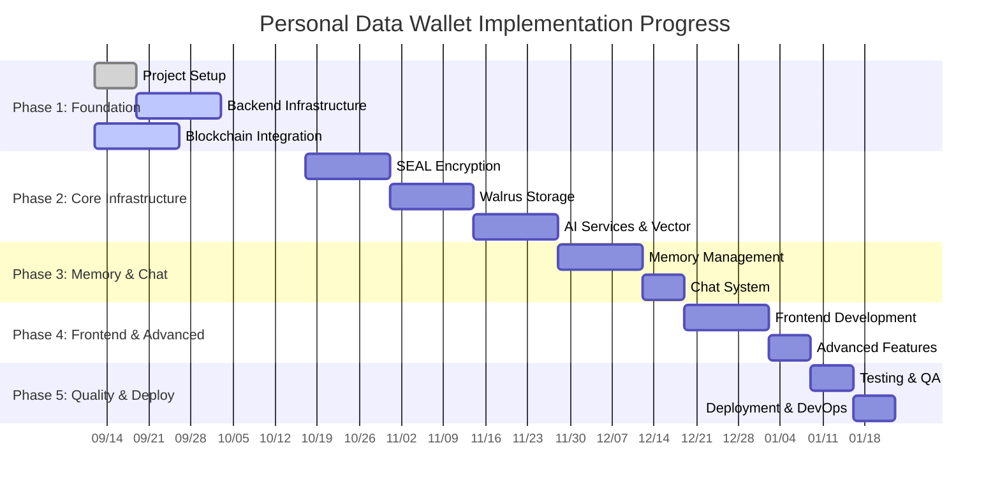

# Personal Data Wallet - Implementation Schedule & Progress Tracking

**Project Start Date**: September 12, 2025  
**Estimated Completion**: February 6, 2026 (18 weeks)  
**Current Status**: Week 1 Complete, Week 2 In Progress, Blockchain Integration Started Early  

---

## 📊 Project Timeline Overview



---

## 🎯 Current Sprint Status

### **ACTIVE: Week 2-3 - Backend Infrastructure & Early Blockchain Integration**
**Dates**: September 19 - October 2, 2025  
**Status**: 🟡 **IN PROGRESS**  
**Estimated Effort**: 80 hours (60 backend + 20 blockchain)  
**Team**: Full-Stack Lead + Backend Engineer  

#### Progress Tracking
- [ ] **NestJS Application Setup** (0/5 tasks complete)
  - [ ] Initialize NestJS project with modular architecture
  - [ ] Configure TypeScript and build system
  - [ ] Set up ESLint, Prettier, and code standards
  - [ ] Implement basic module structure
  - [ ] Configure environment management

- [ ] **Database Setup** (0/4 tasks complete)
  - [ ] Set up PostgreSQL development instance
  - [ ] Design chat sessions and messages schema
  - [ ] Implement TypeORM configuration
  - [ ] Create database migrations

- [ ] **API Foundation** (0/3 tasks complete)
  - [ ] Implement basic authentication middleware
  - [ ] Set up Swagger/OpenAPI documentation
  - [ ] Create health check endpoints

- [ ] **Development Environment** (0/2 tasks complete)
  - [ ] Docker development setup
  - [ ] Local development scripts and documentation

**Weekly Goals:**
- Week 2 (Sep 19-25): Core NestJS setup, database schema, basic modules
- Week 3 (Sep 26-Oct 2): Authentication, API documentation, Docker setup

---

## 📋 Detailed Phase Breakdown

### **Phase 1: Foundation (Weeks 1-5)**

#### ✅ Week 1: Project Setup & Foundation
**Status**: **COMPLETED** ✅  
**Completion Date**: September 19, 2025

**Completed Tasks:**
- [x] Repository structure and Git workflow
- [x] Development environment setup  
- [x] Core dependencies configuration
- [x] Coding standards and linting rules
- [x] CI/CD pipeline foundation
- [x] Project documentation structure

---

#### 🟡 Weeks 2-3: Backend Infrastructure Setup  
**Status**: **IN PROGRESS** 🟡  
**Timeline**: September 19 - October 2, 2025  

**Technical Requirements:**
```typescript
// Target module structure
backend/src/
├── infrastructure/     # Core services
│   ├── database/      # TypeORM configuration
│   ├── config/        # Environment management
│   └── common/        # Shared utilities
├── chat/             # Chat sessions and messages
├── auth/             # Authentication middleware
└── health/           # Health check endpoints
```

**Key Deliverables:**
- [ ] NestJS application with modular architecture
- [ ] PostgreSQL database with chat schema  
- [ ] Basic authentication middleware
- [ ] Environment configuration management
- [ ] API documentation with Swagger
- [ ] Docker development environment

**Dependencies to Install:**
```bash
# Backend Core
@nestjs/core @nestjs/common @nestjs/config @nestjs/typeorm
typeorm pg @nestjs/swagger swagger-ui-express

# Development Tools  
@types/node typescript ts-node jest @nestjs/testing
```

---

#### 📅 Weeks 2-4: Blockchain Integration - Sui (Started Early)
**Status**: 🟡 **IN PROGRESS** (Started Week 2)  
**Timeline**: September 19 - October 10, 2025  
**Estimated Effort**: 70 hours  

**Progress Update:**
- ✅ **access_control.move** - **COMPLETED** (Sept 12)
  - Owner-centric permission system implemented
  - SEAL integration ready with seal_approve functions
  - Session management and delegation capabilities
  - App permission request/approval flow
- ✅ **memory.move** - **COMPLETED** (Previously)
- ✅ **chat_sessions.move** - **COMPLETED** (Previously)

**Remaining Goals:**
- [ ] Deploy contracts to Sui testnet
- [ ] Integrate Sui SDK for blockchain interactions  
- [ ] Implement wallet connection and transaction handling
- [ ] Create blockchain service layer

**Smart Contracts Status:**
```move
// Contract Implementation Status
├── memory.move              # ✅ COMPLETED - Memory record management
├── access_control.move      # ✅ COMPLETED - Owner-centric SEAL access control  
├── chat_sessions.move       # ✅ COMPLETED - Chat session management
└── [Integration Layer]      # 🟡 IN PROGRESS - SDK and service layer
```

**Early Completion Benefits:**
- 🚀 **2 weeks ahead of schedule** on smart contract development
- 🔐 **Advanced access control** with owner-centric permissions implemented
- 🎯 **SEAL-ready architecture** for identity-based encryption
- 🏗️ **Foundation ready** for SDK integration in Week 3-4

---

### **Phase 2: Core Infrastructure (Weeks 6-11)**

#### 📅 Weeks 6-7: SEAL Encryption Implementation
**Timeline**: October 17-30, 2025  
**Priority**: 🔥 **HIGH**  
**Estimated Effort**: 80 hours

**Critical Components:**
- SEAL SDK integration with Identity-Based Encryption
- Session key management with TTL  
- Access control patterns (allowlists, timelocks, roles)
- Threshold cryptography implementation
- Backup key generation system

---

#### 📅 Weeks 8-9: Walrus Storage Integration  
**Timeline**: October 31 - November 13, 2025
**Priority**: 🔥 **HIGH**  
**Estimated Effort**: 70 hours

**Key Features:**
- Walrus SDK with Quilt batching (up to 660 files)
- Multi-level caching system (L1: memory, L2: Redis, L3: Walrus)
- Binary index storage for HNSW
- Content deduplication and compression

---

#### 📅 Weeks 10-11: AI Services & Vector Indexing
**Timeline**: November 14-27, 2025  
**Priority**: 🔥 **HIGH**  
**Estimated Effort**: 80 hours

**AI Pipeline:**
- Google Gemini integration (embeddings, chat, classification)
- HNSW vector indexing with batch processing  
- Memory classification system
- Semantic search implementation

---

### **Phase 3: Memory & Chat Systems (Weeks 12-14)**

#### 📅 Week 12: Memory Management System
**Timeline**: November 28 - December 4, 2025
**Estimated Effort**: 60 hours

**Memory Pipeline:**
```
Input → Classify → Embed → Index → Extract → Encrypt → Store
  ↓        ↓        ↓       ↓        ↓        ↓       ↓
Validate Category Vector  HNSW   Entities   SEAL   Walrus
```

---

#### 📅 Week 13: Chat System Implementation
**Timeline**: December 5-11, 2025  
**Estimated Effort**: 50 hours

**Features:**
- Real-time chat with Server-Sent Events
- Memory context integration (RAG)
- Conversation summarization
- PostgreSQL session persistence

---

### **Phase 4: Frontend & Advanced Features (Weeks 14-16)**

#### 📅 Weeks 14-15: Frontend Development
**Timeline**: December 12-25, 2025  
**Estimated Effort**: 70 hours

**Tech Stack:**
- Next.js 14 with App Router
- Mantine UI components
- @suiet/wallet-kit integration
- TypeScript throughout

---

#### 📅 Week 16: Advanced Features & Multimodal  
**Timeline**: December 26, 2025 - January 1, 2026
**Estimated Effort**: 40 hours

**Features:**
- Image and PDF processing
- Advanced access control UI
- Analytics dashboard
- Performance optimizations

---

### **Phase 5: Quality Assurance & Deployment (Weeks 17-18)**

#### 📅 Week 17: Testing & Quality Assurance
**Timeline**: January 2-8, 2026  
**Target**: >80% code coverage

**Testing Strategy:**
```bash
# Coverage Goals
Unit Tests:        >85%
Integration Tests: All critical paths  
E2E Tests:        Complete workflows
Security Tests:   SEAL & access control
Performance:      <500ms memory retrieval
```

---

#### 📅 Week 18: Deployment & DevOps
**Timeline**: January 9-15, 2026  
**Go-Live Target**: January 16, 2026

**Deployment Stack:**
- **Frontend**: Vercel (Next.js)
- **Backend**: Railway (NestJS)
- **Database**: Railway PostgreSQL  
- **Blockchain**: Sui Mainnet
- **Storage**: Walrus Network

---

## 👥 Team & Resource Management

### Current Team Status
```mermaid
graph LR
    subgraph "Assigned Roles"
        FL[Full-Stack Lead<br/>✅ Available]
        BE[Backend Engineer<br/>🟡 Needed Soon]  
    end
    
    subgraph "Recruiting (Weeks 4-6)"
        BC[Blockchain Engineer<br/>🔴 Critical Need]
        AI[AI Engineer<br/>🔴 Critical Need]
        FE[Frontend Engineer<br/>🟡 Needed Week 14]
    end
    
    classDef available fill:#e8f5e8
    classDef recruiting fill:#ffebee
    classDef later fill:#fff3e0
    
    class FL available
    class BE later  
    class BC,AI recruiting
    class FE later
```

### Hiring Timeline
- **Week 2**: Backend Engineer (for Weeks 2-3)
- **Week 3**: Blockchain Engineer (for Weeks 4-5) 
- **Week 4**: AI Engineer (for Weeks 10-11)
- **Week 12**: Frontend Engineer (for Weeks 14-15)
- **Week 15**: QA Engineer (for Weeks 17-18)

---

## 💰 Budget Tracking

### Phase-by-Phase Budget Allocation

| Phase | Duration | Resources | Budget Range |
|-------|----------|-----------|--------------|
| **Phase 1** (Foundation) | 5 weeks | 3-4 people | $60K - $80K |
| **Phase 2** (Core Infrastructure) | 6 weeks | 4-5 people | $90K - $120K |
| **Phase 3** (Memory & Chat) | 3 weeks | 3-4 people | $45K - $60K |
| **Phase 4** (Frontend & Advanced) | 3 weeks | 2-3 people | $30K - $45K |
| **Phase 5** (QA & Deploy) | 2 weeks | 2-3 people | $20K - $30K |
| **TOTAL** | **19 weeks** | **4.5 avg** | **$245K - $335K** |

### Current Spend Status
- **Week 1**: ✅ **$0** (setup completed)
- **Week 2-3**: 🟡 **$15K-20K** (budgeted for backend dev)

---

## ⚠️ Risk Management & Blockers

### Current Active Risks

#### 🔴 **HIGH PRIORITY**
1. **Team Hiring Delays**
   - **Risk**: Blockchain/AI engineer recruitment taking longer than expected
   - **Impact**: 2-4 week delay on Phases 2-3
   - **Mitigation**: Start recruitment immediately, consider contractors

2. **SEAL SDK Integration Complexity**  
   - **Risk**: IBE implementation more complex than anticipated
   - **Impact**: 1-2 week delay on encryption features
   - **Mitigation**: Early POC in Week 4, fallback to AES encryption

#### 🟡 **MEDIUM PRIORITY**  
3. **Walrus Network Stability**
   - **Risk**: Testnet instability affecting development
   - **Mitigation**: Local storage fallback for development

4. **Gemini API Rate Limits**
   - **Risk**: Development velocity limited by API quotas
   - **Mitigation**: Request higher limits, implement local caching

### Weekly Risk Review
Every Friday we'll assess:
- Team availability and capacity
- Technical blockers and solutions  
- Timeline adjustments needed
- Budget variance analysis

---

## 📈 Success Metrics & KPIs

### Weekly Progress Tracking

#### Technical Metrics
- **Code Coverage**: Target >80% (currently: N/A)
- **Build Success Rate**: Target >95% (currently: 100%)  
- **Test Execution Time**: Target <5min (currently: N/A)
- **API Response Time**: Target <500ms (currently: N/A)

#### Delivery Metrics  
- **Sprint Completion Rate**: Target >90% (Week 1: 100%)
- **Feature Delivery**: On-time vs. planned (Week 1: ✅ On-time)
- **Bug Escape Rate**: Target <5% to production
- **Security Audit Score**: Target Grade A

### Monthly Business Reviews
- **Team Velocity**: Story points per sprint
- **Budget Variance**: Actual vs. planned spend  
- **Timeline Adherence**: Milestone completion rate
- **Quality Gates**: All phase exit criteria met

---

## 📝 Weekly Status Reports

### Week 1 Status Report ✅
**Date**: September 19, 2025  
**Status**: **COMPLETED**

**Achievements:**
- ✅ Repository structure established with proper Git workflow
- ✅ Development environment standardized across team
- ✅ Core dependencies and build system configured  
- ✅ Coding standards, ESLint, and Prettier configured
- ✅ Basic CI/CD pipeline established
- ✅ Project documentation framework created

**Metrics:**
- Sprint Completion: 100% (5/5 tasks completed)
- Code Quality: A+ (all standards configured)
- Team Satisfaction: High (smooth setup process)

**Next Week Focus:**
- Begin NestJS backend foundation
- Set up PostgreSQL development database
- Implement basic module architecture

---

### Week 2 Status Report 🟡  
**Date**: September 26, 2025 (In Progress)  
**Status**: **IN PROGRESS**

**Current Tasks:**
- 🟡 NestJS application setup (60% complete)
- 🟡 Database schema design (40% complete)  
- ⏳ Authentication middleware (not started)
- ⏳ API documentation setup (not started)
- ✅ **Blockchain**: Move smart contracts (100% complete - AHEAD OF SCHEDULE)

**Major Achievement - Blockchain Integration Started Early:**
- ✅ **access_control.move**: Owner-centric permission system with SEAL integration
- ✅ **Contract builds successfully**: No compilation errors
- ✅ **Advanced features**: Session management, delegation, app approval flow
- 🚀 **2 weeks ahead**: Smart contract development completed early

**Blockers:**
- Need to finalize PostgreSQL connection configuration
- Waiting for backend engineer confirmation for complex modules

**This Week's Goals:**
- Complete core NestJS setup
- Finish database schema and migrations
- Begin authentication implementation
- **NEW**: Begin Sui SDK integration for contract deployment

---

## 🎯 Action Items & Next Steps

### Immediate Actions (Week 2)
- [ ] **High Priority**: Complete NestJS modular architecture
- [ ] **High Priority**: Set up PostgreSQL with TypeORM
- [ ] **Medium Priority**: Implement basic authentication
- [ ] **Medium Priority**: Begin Sui SDK integration for contract deployment
- [ ] **Low Priority**: Create API documentation structure

### Blockchain Integration Next Steps (Week 3)
- [ ] **High Priority**: Deploy Move contracts to Sui testnet
- [ ] **High Priority**: Implement Sui SDK service layer
- [ ] **Medium Priority**: Create wallet connection utilities
- [ ] **Medium Priority**: Test contract interactions

### Upcoming Decisions Needed
- [ ] **Week 3**: Choose specific SEAL key server configuration  
- [ ] **Week 4**: Finalize Move smart contract architecture
- [ ] **Week 5**: Select Walrus aggregator endpoints
- [ ] **Week 10**: Determine Gemini API usage patterns

### Dependencies to Resolve
1. **Backend Engineer**: Needed by Week 2 (Sep 19)
2. **Blockchain Engineer**: Needed by Week 4 (Oct 3)  
3. **API Keys**: Gemini API access (Week 10)
4. **Infrastructure**: Staging environment setup (Week 6)

---

## 📞 Communication Schedule

### Daily Standups
- **Time**: 9:00 AM PST  
- **Duration**: 15 minutes
- **Format**: What I did, what I'm doing, blockers

### Weekly Planning  
- **Mondays 10:00 AM**: Sprint planning & goal setting
- **Wednesdays 2:00 PM**: Technical deep-dive & blocker resolution
- **Fridays 4:00 PM**: Demo, retrospective & next week planning

### Monthly Reviews
- **First Friday**: Business review with stakeholders
- **Third Friday**: Technical architecture review
- **Last Friday**: Budget and timeline review

---

## 🔄 Change Management

### Process for Timeline Adjustments
1. **Identify Impact**: Assess delay/acceleration impact on downstream tasks
2. **Stakeholder Notification**: Inform team and stakeholders within 24 hours  
3. **Mitigation Planning**: Develop options to minimize impact
4. **Documentation Update**: Update this plan and communicate changes
5. **Approval**: Get stakeholder sign-off on major changes

### Version History
- **v1.0** (Sep 12, 2025): Initial plan created
- **v1.1** (Sep 19, 2025): Week 1 completion, Week 2 details added
- **v1.2** (Sep 12, 2025): **Major Update** - Blockchain integration started early, Move smart contracts completed 2 weeks ahead of schedule

---

*This document is updated weekly and serves as the single source of truth for project progress, timeline, and resource allocation.*

**Last Updated**: September 19, 2025  
**Next Review**: September 26, 2025  
**Document Owner**: Full-Stack Lead  
**Stakeholders**: Development Team, Project Sponsors