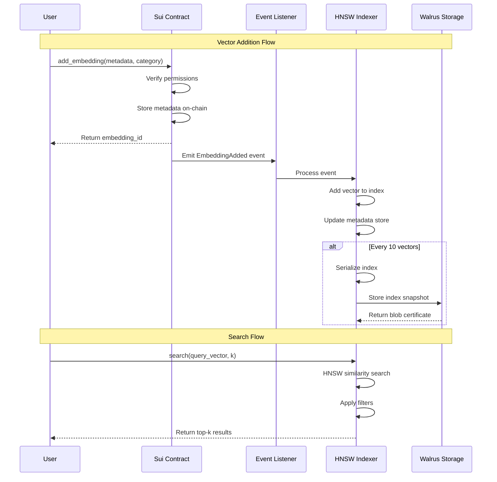
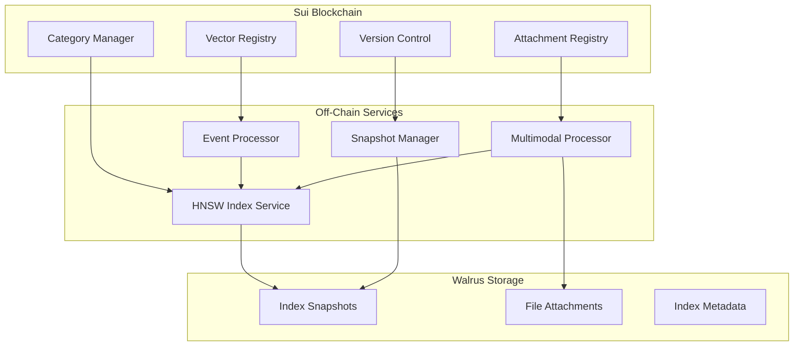
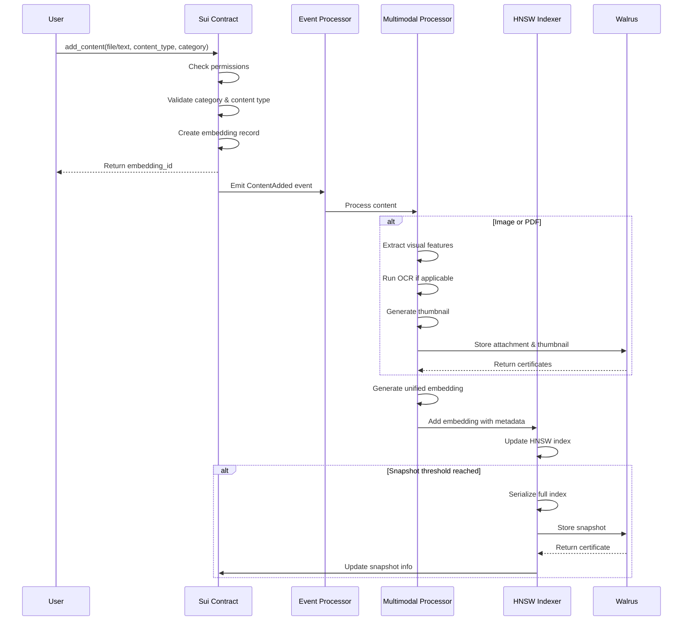
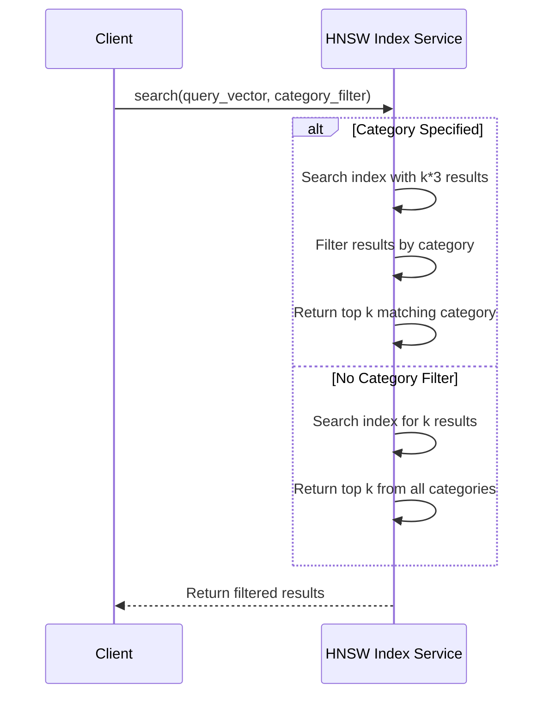

# Decentralized Vector Index Design for Sui Network

## Table of Contents
1. [Executive Summary](#executive-summary)
2. [Current Architecture Analysis](#current-architecture-analysis)
3. [Design Goals](#design-goals)
4. [Proposed Architecture](#proposed-architecture)
5. [Technical Components](#technical-components)
6. [Implementation Workflow](#implementation-workflow)
7. [Performance Considerations](#performance-considerations)
8. [Security Model](#security-model)
9. [Cost Analysis](#cost-analysis)
10. [Migration Strategy](#migration-strategy)

## Executive Summary

This document presents a practical design for an enhanced decentralized vector index system built on Sui Network, integrating Walrus storage and HNSW algorithms. The design uses a single HNSW index with category-based filtering and multimodal support for text, images, and PDFs. Categories are predefined by developers for logical organization and user experience.

## Current Architecture Analysis
### Existing Components

#### 1. Sui Smart Contract (`vector_index.move`)
- **Purpose**: On-chain metadata storage and permission management
- **Key Structures**:
  ```move
  struct VectorEmbedding {
      id: UID,
      owner: address,
      walrus_hash: String,           // Reference to vector in Walrus
      metadata_vector: vector<u64>,  // Metadata for fast search
      category: String,
      ibe_identity: String,          // Reserved for future IBE
      policy_hash: String,           // Reserved for future access control
      creation_time: u64,
      last_accessed: u64
  }
  ```
- **Events**: `EmbeddingAdded`, `EmbeddingAccessed`, `EmbeddingRemoved`

#### 2. HNSW Indexer Service
- **Technology**: hnswlib (Hierarchical Navigable Small World)
- **Performance**: Sub-100ms similarity search
- **Capacity**: 100,000 vectors (configurable)
- **Features**:
  - In-memory vector storage
  - Cosine similarity metric
  - Category/owner filtering
  - Serialization support

#### 3. Event-Driven Coordination
- **Sui Events Listener**: Monitors blockchain events
- **Automatic Updates**: HNSW index updates on embedding events
- **Backup Strategy**: Periodic persistence to Walrus (every 10 vectors)

#### 4. Walrus Integration
- **Storage Type**: Blob storage for serialized HNSW indices
- **Current Implementation**: Basic store/retrieve operations
- **Cost**: Standard blob storage rates

### Current Workflow



### Limitations

1. **Basic Persistence**: Full index snapshots only
2. **Limited Recovery**: Must reload entire index from Walrus
3. **No Version Control**: Cannot rollback to previous states
4. **No Category Organization**: All vectors mixed together
5. **Inefficient Updates**: Must save entire index for any change

## Design Goals

1. **Simplicity**: Single index with category filtering
2. **Scalability**: Support millions of vectors in one index
3. **Performance**: Maintain sub-100ms query latency
4. **Cost Efficiency**: Delta updates reduce storage by 10x
5. **Maintainability**: One index to manage and monitor
6. **User Experience**: Intuitive category selection for users

## Proposed Architecture

### High-Level Design



### Key Concepts

### Key Design Decisions

#### 1. Multimodal Model Selection
The system uses Google Gemini's multimodal capabilities:
- **Gemini Pro Vision**: For image understanding and embeddings
- **Gemini Pro**: For text embeddings and generation
- **Unified Embeddings**: 768-dimensional vectors for all content types
- **OCR Integration**: Built-in text extraction from images/PDFs

This provides:
- Consistent embedding space across modalities
- State-of-the-art understanding of visual content
- Automatic text extraction without separate OCR service
- Natural language understanding of queries

#### 2. Developer-Managed Categories
The system uses predefined categories managed by developers rather than user-generated categories. This provides several benefits:
- **Predictable Performance**: Known number of shards
- **Easier Maintenance**: Fixed category set to monitor
- **Better User Experience**: Clear category choices
- **Optimized Search**: Can tune each category shard separately

#### 2. Category-Based Filtering Architecture
```move
module vector_index_v2 {
    // Predefined categories managed by developers
    const CATEGORY_PERSONAL: vector<u8> = b"personal";
    const CATEGORY_WORK: vector<u8> = b"work";
    const CATEGORY_FINANCE: vector<u8> = b"finance";
    const CATEGORY_HEALTH: vector<u8> = b"health";
    const CATEGORY_EDUCATION: vector<u8> = b"education";
    const CATEGORY_TRAVEL: vector<u8> = b"travel";
    const CATEGORY_SHOPPING: vector<u8> = b"shopping";
    const CATEGORY_SOCIAL: vector<u8> = b"social";
    const CATEGORY_GENERAL: vector<u8> = b"general";
    
    struct VectorIndex has key, store {
        id: UID,
        dimension: u64,
        current_version: u64,
        walrus_certificate: String,     // Points to current index state
        total_vectors: u64,
        last_snapshot_version: u64,
        last_delta_version: u64,
        allowed_categories: vector<String>
    }
    
    // Enhanced vector embedding with category
    struct VectorEmbedding has key, store {
        id: UID,
        owner: address,
        walrus_hash: String,
        metadata_vector: vector<u64>,
        category: String,               // Must be one of predefined categories
        content_type: String,           // text, image, pdf, etc.
        attachment_hash: Option<String>, // Walrus hash for file attachment
        ibe_identity: String,
        policy_hash: String,
        creation_time: u64,
        last_accessed: u64,
        version: u64                    // Version when this was added
    }
    
    // Track file attachments separately for efficient management
    struct FileAttachment has key, store {
        id: UID,
        embedding_id: address,          // Reference to VectorEmbedding
        file_type: String,              // image/jpeg, application/pdf, etc.
        file_size: u64,
        walrus_certificate: String,     // Where the file is stored
        thumbnail_hash: Option<String>, // For images/PDFs preview
        extracted_text: Option<String>, // OCR/text extraction result
        metadata: Table<String, String> // Additional file metadata
    }
    
    // The VectorIndex serves as the on-chain record that:
    // 1. Tracks the current state of the single HNSW index
    // 2. Validates categories and permissions
    // 3. Maintains version history for recovery
    // 4. Provides metadata for the off-chain index service
}
```

#### 3. Simple Snapshot System
```rust
// Track the current index state
struct IndexSnapshot {
    version: u64,                          // Current version number
    walrus_certificate: String,            // Walrus location of full index
    total_vectors: u64,                    // Total vectors in this version
    timestamp: u64,                        // When this snapshot was created
    category_counts: Table<String, u64>,   // Vectors per category
}
```

#### 4. Snapshot Management
```move
public fun update_snapshot(
    index: &mut VectorIndex,
    new_certificate: String,
    total_vectors: u64,
    ctx: &mut TxContext
) {
    // Update to new snapshot
    index.walrus_certificate = new_certificate;
    index.total_vectors = total_vectors;
    index.current_version = index.current_version + 1;
    index.last_snapshot_time = tx_context::epoch_timestamp_ms(ctx);
}
```

## Technical Components

### 1. Multimodal Processor
```python
class MultimodalProcessor:
    """
    Processes different content types (text, images, PDFs) into unified embeddings.
    Uses appropriate models for each content type.
    """
    def __init__(self):
        # Initialize multimodal models
        self.text_model = TextEmbeddingModel()  # e.g., Gemini Text
        self.vision_model = VisionEmbeddingModel()  # e.g., Gemini Vision
        self.unified_model = UnifiedEmbeddingModel()  # e.g., CLIP or custom
        self.ocr_engine = OCREngine()  # For text extraction from images/PDFs
        self.pdf_processor = PDFProcessor()
        
    async def process_content(self, content: bytes, content_type: str, 
                            metadata: dict) -> ProcessedContent:
        if content_type.startswith('text/'):
            return await self._process_text(content, metadata)
        elif content_type.startswith('image/'):
            return await self._process_image(content, metadata)
        elif content_type == 'application/pdf':
            return await self._process_pdf(content, metadata)
        else:
            raise ValueError(f"Unsupported content type: {content_type}")
    
    async def _process_image(self, image_bytes: bytes, metadata: dict):
        # Extract visual features
        image_embedding = await self.vision_model.encode(image_bytes)
        
        # Extract text if present (OCR)
        extracted_text = await self.ocr_engine.extract_text(image_bytes)
        text_embedding = None
        if extracted_text:
            text_embedding = await self.text_model.encode(extracted_text)
        
        # Generate unified embedding
        if text_embedding is not None:
            # Combine visual and textual features
            unified_embedding = self._combine_embeddings(
                image_embedding, text_embedding, weights=[0.7, 0.3]
            )
        else:
            unified_embedding = image_embedding
        
        # Generate thumbnail
        thumbnail = await self._generate_thumbnail(image_bytes)
        
        return ProcessedContent(
            embedding=unified_embedding,
            extracted_text=extracted_text,
            thumbnail=thumbnail,
            metadata={
                **metadata,
                'has_text': bool(extracted_text),
                'embedding_type': 'multimodal' if text_embedding else 'visual'
            }
        )
    
    async def _process_pdf(self, pdf_bytes: bytes, metadata: dict):
        # Extract text and images from PDF
        pdf_content = await self.pdf_processor.extract_content(pdf_bytes)
        
        # Process text content
        text_embeddings = []
        if pdf_content.text:
            # Split into chunks for long PDFs
            chunks = self._chunk_text(pdf_content.text, max_tokens=512)
            for chunk in chunks:
                emb = await self.text_model.encode(chunk)
                text_embeddings.append(emb)
        
        # Process images in PDF
        image_embeddings = []
        for image in pdf_content.images:
            emb = await self.vision_model.encode(image)
            image_embeddings.append(emb)
        
        # Create unified embedding
        all_embeddings = text_embeddings + image_embeddings
        if all_embeddings:
            unified_embedding = np.mean(all_embeddings, axis=0)
        else:
            # Empty PDF - use metadata
            unified_embedding = await self.text_model.encode(str(metadata))
        
        # Generate preview thumbnail
        thumbnail = await self._generate_pdf_thumbnail(pdf_bytes)
        
        return ProcessedContent(
            embedding=unified_embedding,
            extracted_text=pdf_content.text[:1000],  # First 1000 chars
            thumbnail=thumbnail,
            metadata={
                **metadata,
                'page_count': pdf_content.page_count,
                'has_images': len(pdf_content.images) > 0,
                'text_length': len(pdf_content.text)
            }
        )
```

## Technical Components

### 2. Single Index with Multimodal Support
```python
class MultimodalHNSWService:
    def __init__(self):
        self.dimension = 768  # Unified embedding dimension
        self.index = hnswlib.Index(space='cosine', dim=self.dimension)
        self.metadata_store = {}  # Stores category, content type, etc.
        self.version = 0
        
        # Predefined categories
        self.categories = [
            'personal', 'work', 'finance', 'health', 
            'education', 'travel', 'shopping', 'social', 'general'
        ]
        
        # Supported content types
        self.content_types = [
            'text/plain', 'text/markdown',
            'image/jpeg', 'image/png', 'image/webp',
            'application/pdf'
        ]
    
    async def search(self, query: Union[str, bytes], 
                    search_type: str = 'auto',
                    category: str = None,
                    content_type_filter: str = None,
                    k: int = 10) -> List[SearchResult]:
        # Process query based on type
        if search_type == 'auto':
            if isinstance(query, str):
                query_vector = await self.text_model.encode(query)
            else:
                query_vector = await self.vision_model.encode(query)
        elif search_type == 'text':
            query_vector = await self.text_model.encode(str(query))
        elif search_type == 'image':
            query_vector = await self.vision_model.encode(query)
        else:
            query_vector = query  # Assume pre-computed embedding
        
        # Search the full index
        labels, distances = self.index.knn_query(query_vector, k=k*3)
        
        results = []
        for label, distance in zip(labels[0], distances[0]):
            metadata = self.metadata_store.get(str(label))
            if metadata:
                # Apply filters
                if category and metadata['category'] != category:
                    continue
                if content_type_filter and metadata['content_type'] != content_type_filter:
                    continue
                    
                results.append(SearchResult(
                    id=str(label),
                    score=1 - distance,
                    metadata=metadata,
                    content_type=metadata['content_type'],
                    has_attachment=metadata.get('attachment_hash') is not None
                ))
                
                if len(results) >= k:
                    break
        
        return results
```

### 3. Enhanced HNSW Indexer with Multimodal Support
```python
class EnhancedHNSWIndexer:
    def __init__(self, config: IndexConfig):
        self.index = hnswlib.Index(space='cosine', dim=config.dimension)
        self.metadata_store = {}
        self.version = 0
        self.operations_since_snapshot = 0
        self.snapshot_threshold = 100  # Save snapshot every 100 operations
        self.walrus_client = WalrusClient()
        self.sui_client = SuiClient()
        
    async def add_multimodal_embedding(self, 
                                      embedding_id: str, 
                                      content: bytes,
                                      content_type: str,
                                      category: str, 
                                      metadata: dict):
        # Validate inputs
        if category not in self.categories:
            raise ValueError(f"Invalid category: {category}")
        if content_type not in self.content_types:
            raise ValueError(f"Unsupported content type: {content_type}")
            
        # Process content through multimodal processor
        processed = await self.multimodal_processor.process_content(
            content, content_type, metadata
        )
        
        # Store file attachment if not plain text
        attachment_hash = None
        if content_type != 'text/plain':
            # Store original file in Walrus
            attachment_cert = await self.walrus_client.store_blob(content)
            attachment_hash = attachment_cert.hash
            
            # Store thumbnail if generated
            if processed.thumbnail:
                thumb_cert = await self.walrus_client.store_blob(processed.thumbnail)
                metadata['thumbnail_hash'] = thumb_cert.hash
        
        # Add to HNSW index
        self.index.add_items(processed.embedding.reshape(1, -1), [embedding_id])
        
        # Store enhanced metadata
        metadata.update({
            'category': category,
            'content_type': content_type,
            'attachment_hash': attachment_hash,
            'extracted_text': processed.extracted_text[:500] if processed.extracted_text else None,
            'processing_metadata': processed.metadata
        })
        self.metadata_store[embedding_id] = metadata
        
        self.operations_since_snapshot += 1
        
        # Persist snapshot if threshold reached
        if self.operations_since_snapshot >= self.snapshot_threshold:
            await self._persist_snapshot()
            
    async def _persist_snapshot(self):
        # Serialize entire index
        snapshot_data = await self.serialize_index()
        cert = await self.walrus_client.store_blob(snapshot_data)
        
        # Update version on Sui
        await self.sui_client.update_snapshot(
            cert,
            len(self.metadata_store),
            self.version + 1
        )
        
        self.version += 1
        self.operations_since_snapshot = 0
```

### 4. Snapshot Manager
```python
class SnapshotManager:
    """
    Manages periodic snapshots of the vector index.
    Saves complete index state to Walrus at regular intervals.
    """
    def __init__(self, indexer: HNSWIndexer):
        self.indexer = indexer
        self.last_snapshot_time = datetime.now()
        self.snapshot_interval_hours = 24  # Daily snapshots
        
    async def should_snapshot(self) -> bool:
        # Check if enough time has passed or enough operations
        time_elapsed = (datetime.now() - self.last_snapshot_time).total_seconds() / 3600
        return time_elapsed >= self.snapshot_interval_hours
    
    async def create_snapshot(self) -> bytes:
        # Serialize the complete index state
        index_data = {
            'hnsw_index': self.indexer.index,
            'metadata_store': self.indexer.metadata_store,
            'embedding_id_to_index': self.indexer.embedding_id_to_index,
            'next_index_id': self.indexer.next_index_id,
            'timestamp': datetime.now().isoformat(),
            'version': self.indexer.version
        }
        
        buffer = io.BytesIO()
        pickle.dump(index_data, buffer)
        return buffer.getvalue()
    
    async def restore_from_snapshot(self, snapshot_data: bytes):
        # Restore complete index state
        buffer = io.BytesIO(snapshot_data)
        index_data = pickle.load(buffer)
        
        self.indexer.index = index_data['hnsw_index']
        self.indexer.metadata_store = index_data['metadata_store']
        self.indexer.embedding_id_to_index = index_data['embedding_id_to_index']
        self.indexer.next_index_id = index_data['next_index_id']
        self.indexer.version = index_data['version']
```

### 5. Index Recovery Service
```python
class IndexRecoveryService:
    """
    Recovers a vector index from the latest snapshot.
    Simple and reliable recovery process.
    """
    def __init__(self, walrus_client: WalrusClient, sui_client: SuiClient):
        self.walrus_client = walrus_client
        self.sui_client = sui_client
        
    async def recover_index(self) -> HNSWIndexer:
        # Get latest snapshot info from Sui
        index_info = await self.sui_client.get_index_info()
        
        # Load snapshot from Walrus
        snapshot_data = await self.walrus_client.retrieve_blob(
            index_info.walrus_certificate
        )
        
        # Create new indexer and restore state
        indexer = HNSWIndexer()
        snapshot_manager = SnapshotManager(indexer)
        await snapshot_manager.restore_from_snapshot(snapshot_data)
        
        logger.info(f"Recovered index version {indexer.version} with {len(indexer.metadata_store)} vectors")
        return indexer
```

## Implementation Workflow

### Use Cases for Multimodal Search

1. **Personal Memory Recall**
   - "Find all photos from my trip to Paris" (text → image)
   - Upload a business card photo to find all related contacts (image → text/image)
   - "Show me all financial documents from 2023" (text → PDF)

2. **Document Organization**
   - Store receipts as images, search by merchant name
   - Save PDFs of contracts, search by key terms
   - Mixed meeting notes (text + whiteboard photos)

3. **Cross-Modal Discovery**
   - Find similar images to a uploaded photo
   - Locate documents discussing topics shown in an image
   - Search PDFs containing specific diagrams

## Implementation Workflow

### 1. Multimodal Content Addition Flow


### 2. Improved Search Flow


## Storage and Recovery Strategy

### Periodic Snapshot Approach

**Current Implementation:**
1. **Snapshot Triggers**:
   - Every 100 vector additions
   - Daily scheduled snapshots
   - Manual snapshot on demand

2. **Storage Pattern**:
   - Complete index saved to Walrus
   - Previous snapshot can be retained for safety
   - Simple version incrementing

3. **Recovery Process**:
   - Load latest snapshot from Walrus
   - Index immediately operational
   - No complex reconstruction needed

## Performance Considerations

### 1. Indexing Performance
- **Batch Processing**: Group operations before persisting
- **Single Index**: No coordination overhead
- **Periodic Snapshots**: Save complete index at intervals
- **Smart Persistence**: Persist based on operation count or time

### 2. Query Performance
- **Category Filtering**: Post-filter results for specific categories
- **In-Memory Search**: Single HNSW index kept in memory
- **Simple Architecture**: No routing overhead
- **Direct Results**: No caching overhead, always fresh data

### 3. Storage Optimization
- **Compression**: Compress vectors before storage
- **Delta Storage**: Store only changes between versions
- **Snapshot Strategy**: Periodic full snapshots with delta chains
- **Garbage Collection**: Remove old snapshots after consolidation

## Security Model

### 1. Access Control
```move
struct AccessPolicy has store {
    owner: address,
    read_list: vector<address>,
    write_list: vector<address>,
    delegate_list: vector<address>,
    expiry: Option<u64>,
}

public fun check_access(
    policy: &AccessPolicy,
    user: address,
    operation: AccessType,
    ctx: &TxContext
): bool {
    // Check owner
    if (policy.owner == user) return true;
    
    // Check operation-specific permissions
    if (operation == AccessType::READ) {
        return vector::contains(&policy.read_list, &user);
    } else if (operation == AccessType::WRITE) {
        return vector::contains(&policy.write_list, &user);
    }
    
    false
}
```

### 2. Data Protection
- **On-Chain Access Control**: Permission checks in smart contracts
- **Transport Security**: TLS 1.3 for all communications
- **Walrus Storage**: Inherent redundancy and availability
- **Version Control**: Immutable audit trail of all changes

### 3. Audit Trail
```move
struct AuditEntry has store, drop {
    timestamp: u64,
    user: address,
    operation: String,
    category: String,
    result_hash: vector<u8>,
}

public fun log_operation(
    audit_log: &mut vector<AuditEntry>,
    operation: String,
    category: String,
    ctx: &TxContext
) {
    let entry = AuditEntry {
        timestamp: tx_context::epoch_timestamp_ms(ctx),
        user: tx_context::sender(ctx),
        operation,
        category,
        result_hash: hash(operation)
    };
    vector::push_back(audit_log, entry);
}
```

## Cost Analysis

### 1. Storage Costs
- **Index Snapshots**: $0.01 per 1000 vectors per epoch
- **File Attachments**: $0.02 per GB per epoch (images/PDFs)
- **Thumbnails**: $0.001 per 1000 thumbnails per epoch
- **Total Pattern**: Index + attachments + redundancy

### 2. Computation Costs
- **Text Processing**: $0.001 per 1000 text embeddings
- **Image Processing**: $0.01 per 100 images (includes OCR)
- **PDF Processing**: $0.02 per 100 PDFs (text + images)
- **Search**: $0.0001 per query
- **Multimodal Fusion**: $0.001 per unified embedding

### 3. Transaction Costs
- **Sui Gas**: ~0.001 SUI per vector addition
- **Batch Updates**: Amortized to 0.0001 SUI per vector

## Migration Strategy

### Phase 1: Parallel Running (Weeks 1-4)
1. Deploy new contracts alongside existing system
2. Mirror all new vectors to both systems
3. Compare query results for validation

### Phase 2: Gradual Migration (Weeks 5-8)
1. Migrate historical data in batches
2. Route increasing percentage of queries to new system
3. Monitor performance and accuracy

### Phase 3: Cutover (Weeks 9-10)
1. Final data synchronization
2. Update all client SDKs
3. Deprecate old system

### Phase 4: Optimization (Ongoing)
1. Tune category filters based on usage patterns
2. Optimize delta persistence thresholds
3. Add new features (multi-modal search, etc.)

## Conclusion

This design provides a practical, multimodal vector index system for the Sui ecosystem. By implementing:

1. **Multimodal Support**: Unified search across text, images, and PDFs
2. **Predefined Categories**: Simple, developer-managed categories for organization
3. **Single Index Architecture**: All content types in one searchable index
4. **Simple Snapshots**: Periodic full index snapshots for reliability
5. **Event-Driven Updates**: Seamless blockchain-to-indexer coordination

The multimodal single index approach provides powerful capabilities:
- **For Users**: 
  - Search memories by text, image, or both
  - Store receipts, documents, photos with automatic understanding
  - Find content regardless of format
- **For Developers**: 
  - Unified API for all content types
  - Simple architecture with rich functionality
- **For Operations**: 
  - Single index to monitor and optimize
  - Predictable resource usage

## Future Work

### 1. Delta Update System
As the system scales beyond personal use, implementing delta updates could provide significant benefits:

#### Concept
Delta updates store only changes between index versions rather than complete snapshots:
```rust
struct DeltaUpdate {
    from_version: u64,
    to_version: u64,
    additions: Vec<(String, Vec<f32>, String)>,
    removals: Vec<String>,
    updates: Vec<(String, Vec<f32>)>,
    timestamp: DateTime,
}
```

#### Benefits
- **Storage Efficiency**: 10x reduction in storage costs
- **Version History**: Ability to rollback to any previous state
- **Efficient Sync**: Only transfer changes between nodes
- **Audit Trail**: Complete history of all modifications

#### Implementation Considerations
- Complex recovery process (apply deltas sequentially)
- Need for periodic consolidation
- Version management overhead
- Best suited for systems with millions of vectors

### 2. Advanced Security Features

#### Zero-Knowledge Proofs
- Prove vector ownership without revealing content
- Privacy-preserving similarity search
- Selective disclosure of categories

#### Seal Encryption (IBE)
- Identity-based encryption for vectors
- Fine-grained access control
- Searchable encryption capabilities

### 3. Scalability Enhancements

#### Sharding Architecture
For massive scale (100M+ vectors), implement category-based sharding:
- Separate HNSW indices per category
- Parallel processing capabilities
- Independent scaling per category
- Fault isolation between shards

#### Walrus-Quilt Integration
- Erasure coding for better availability
- Reduced storage costs
- Improved read performance

### 4. Enhanced Search Features

#### Advanced Multi-Modal Features
- Video support with frame extraction
- Audio transcription and search
- Document similarity clustering
- Multi-language OCR support

#### Semantic Categories
- AI-powered category suggestions
- Dynamic category creation
- Category relationship graphs

### 5. Performance Optimizations

#### Caching Layer
For high-traffic scenarios:
- Redis-based result caching
- Query pattern analysis
- Predictive pre-fetching

#### Hardware Acceleration
- GPU-accelerated similarity search
- SIMD optimizations
- Custom ASIC integration

These enhancements should be considered as the system grows beyond personal use cases and requires enterprise-scale capabilities.