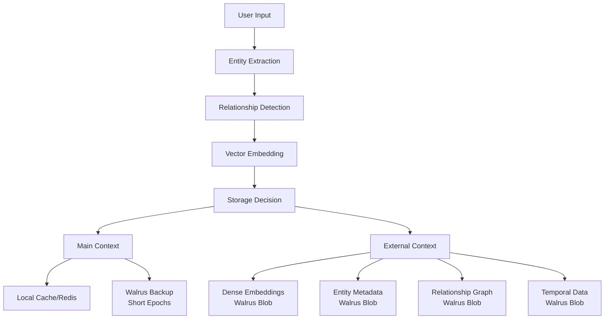
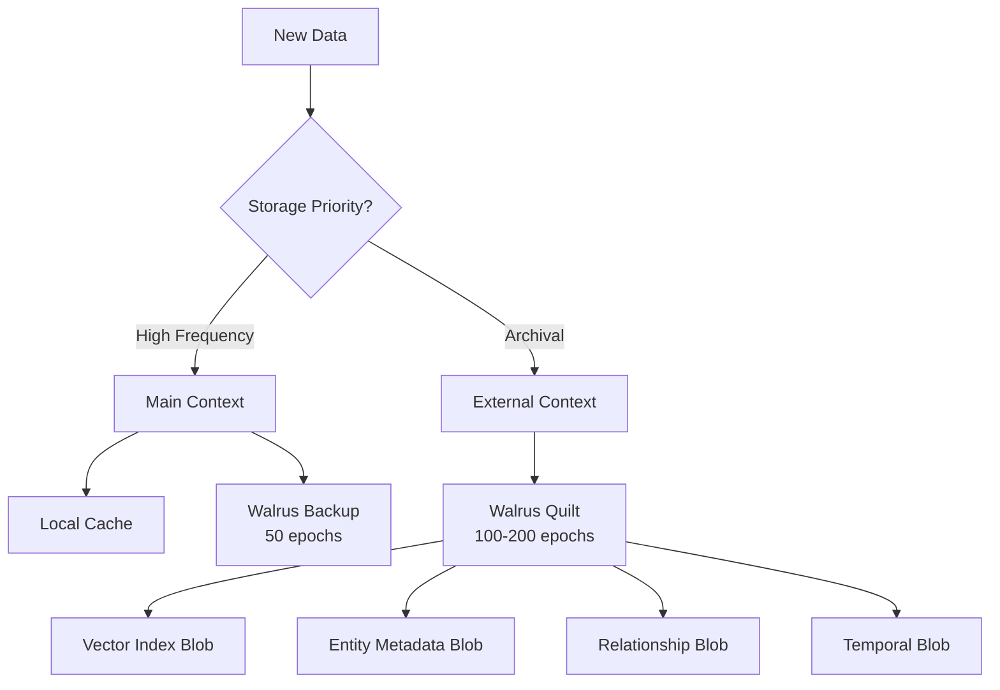
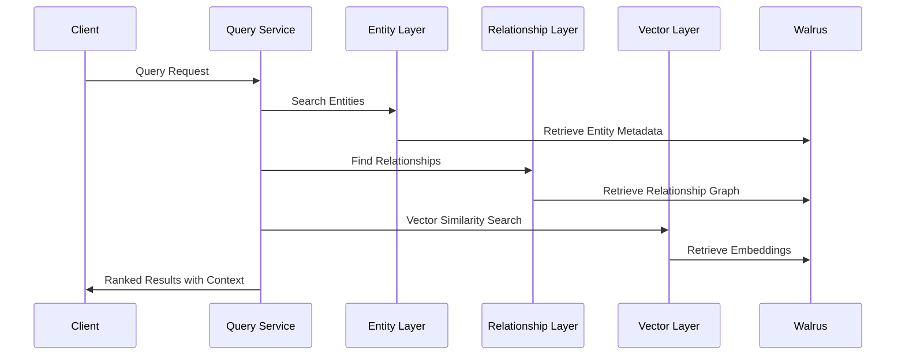

# Walrus Quilt Vector Embedding Architecture

## Overview

This document describes the architecture for storing vector embeddings using Walrus Quilt technology in our Personal Data Wallet application. The implementation follows advanced memory management patterns with hierarchical storage layers and semantic relationship modeling.

## Table of Contents

- [Architecture Overview](#architecture-overview)
- [Memory Layer Architecture](#memory-layer-architecture)
- [Storage Components](#storage-components)
- [Data Models](#data-models)
- [Query Architecture](#query-architecture)
- [CLI Integration](#cli-integration)
- [Implementation Details](#implementation-details)
- [Benefits](#benefits)
- [Usage Examples](#usage-examples)

## Architecture Overview



## Memory Layer Architecture

### Two-Tier Storage System

#### Main Context (Fast Access Layer)
- **Purpose**: Recently accessed data, current conversation context
- **Storage**: Local memory/cache + Redis + Walrus backup
- **Duration**: Short-term (50 epochs on Walrus)
- **Pattern**: RAM-like behavior for hot data
- **Use Cases**: 
  - Active conversation embeddings
  - Frequently queried entities
  - Recent relationship updates

#### External Context (Persistent Storage Layer)
- **Purpose**: Long-term memory, historical data
- **Storage**: Walrus Quilt blobs
- **Duration**: Long-term (100-200 epochs)
- **Pattern**: Disk-like behavior for cold data
- **Use Cases**:
  - Complete user memory archive
  - Historical entity relationships
  - Long-term preference patterns

### Storage Decision Flow



## Storage Components

### 1. Dense Embeddings Component

**Purpose:** Pure vector similarity search capability

```json
{
  "component_type": "vector_index",
  "memory_layer": "dense_embeddings",
  "storage_priority": "external_context",
  "data": "binary_hnsw_index"
}
```

- **Storage Format**: Binary HNSW index
- **Query Method**: Cosine similarity search
- **Optimization**: Compressed vector representation

### 2. Entity Metadata Component

**Purpose:** Semantic understanding and entity classification

```json
{
  "component_type": "entity_metadata",
  "memory_layer": "entity_graph",
  "entities": {
    "user_001": {
      "entity_type": "Person",
      "creation_timestamp": "2024-01-01T00:00:00Z",
      "semantic_meaning": "Primary system user",
      "confidence_score": 0.95
    }
  }
}
```

- **Storage Format**: JSON with structured entity data
- **Query Method**: Type-based filtering, semantic search
- **Features**: Confidence scoring, temporal tracking

### 3. Relationship Graph Component

**Purpose:** Model connections and interactions between entities

```json
{
  "component_type": "relationship_graph",
  "memory_layer": "relationship_triplets",
  "relationships": [
    {
      "source_entity": "user_001",
      "relationship_type": "works_at",
      "destination_entity": "tech_corp",
      "confidence_score": 0.94,
      "temporal_context": "currently"
    }
  ]
}
```

- **Storage Format**: Array of relationship triplets
- **Query Method**: Graph traversal, path finding
- **Features**: Temporal context, confidence weighting

### 4. Temporal Context Component

**Purpose:** Time-aware memory management and relevance decay

```json
{
  "component_type": "temporal_metadata",
  "memory_layer": "temporal_context",
  "timestamps": {
    "created_at": "2024-01-01T00:00:00Z",
    "last_accessed": "2024-01-15T10:30:00Z",
    "last_updated": "2024-01-10T14:20:00Z"
  }
}
```

- **Storage Format**: JSON with timestamp metadata
- **Query Method**: Time-range filtering, recency scoring
- **Features**: Access pattern tracking, aging algorithms

## Data Models

### Core Models

```python
class EntityInfo(BaseModel):
    entity_type: str          # Person, Location, Event, etc.
    creation_timestamp: str   # ISO format timestamp
    semantic_meaning: str     # Human-readable description
    confidence_score: float   # 0.0 to 1.0 confidence

class RelationshipTriplet(BaseModel):
    source_entity: str        # Source entity identifier
    relationship_type: str    # Type of relationship
    destination_entity: str   # Target entity identifier
    confidence_score: float   # Relationship strength
    temporal_context: Optional[str]  # Time context

class MemoryStorageComponents(BaseModel):
    vector_index_data: bytes                    # HNSW index binary
    entity_metadata: Dict[str, EntityInfo]      # Entity graph
    relationship_graph: List[RelationshipTriplet]  # Triplets
    temporal_metadata: Dict[str, str]           # Time data
    retrieval_config: Dict[str, Any]            # Query params

class EnhancedEmbeddingQuiltData(BaseModel):
    user_id: str
    embeddings: List[EmbeddingResult]
    entity_metadata: Dict[str, EntityInfo] = {}
    relationship_metadata: List[RelationshipTriplet] = []
    retrieval_metadata: Dict[str, Any] = {}
    temporal_metadata: Dict[str, str] = {}
    storage_layer: str = "external_context"  # main_context | external_context
```

## Query Architecture

### Two-Stage Retrieval System

#### Stage 1: Metadata Query
1. **Entity Search**: Find relevant entities by type and semantic meaning
2. **Relationship Traversal**: Explore connections between query entities and stored entities
3. **Temporal Filtering**: Apply time-based relevance scoring
4. **Confidence Ranking**: Sort by entity and relationship confidence scores

#### Stage 2: Vector Retrieval
1. **Guided Search**: Use entity matches to focus vector search
2. **Semantic Similarity**: Apply cosine similarity on embeddings
3. **Context Fusion**: Combine relationship context with vector similarity
4. **Ranked Results**: Return results with full semantic context

### Query Flow



## CLI Integration

### Walrus CLI Commands

#### Store Enhanced Embeddings as Quilt

```bash
walrus store-quilt --epochs 100 --deletable --blobs \
  '{"path":"./enhanced_embedding_000000.json","identifier":"enhanced_embedding_000000","tags":{"type":"enhanced_embedding","user_id":"test_user","storage_layer":"external_context"}}' \
  '{"path":"./entity_graph.json","identifier":"entity_graph","tags":{"type":"entity_graph","component":"entity_metadata"}}' \
  '{"path":"./relationship_triplets.json","identifier":"relationship_triplets","tags":{"type":"relationship_triplets","component":"relationship_graph"}}'
```

#### Retrieve Quilt Contents

```bash
# List all patches in a quilt
walrus list-patches-in-quilt <QUILT_ID>

# Read specific components
walrus read-quilt <QUILT_ID> --patch-id enhanced_embedding_000000
walrus read-quilt <QUILT_ID> --patch-id entity_graph
walrus read-quilt <QUILT_ID> --patch-id relationship_triplets
```

#### Query Blob Status

```bash
# Check storage status
walrus blob-status --blob-id <BLOB_ID>

# Get quilt information
walrus info --quilt-id <QUILT_ID>
```

## Implementation Details

### WalrusClient Methods

#### Enhanced Storage Methods

```python
# Store complete memory components
async def store_memory_components_quilt(
    self, 
    components: MemoryStorageComponents, 
    user_id: str, 
    epochs: int = 200
) -> Optional[str]

# Store enhanced embeddings with metadata
async def store_enhanced_embeddings_quilt(
    self, 
    enhanced_data: EnhancedEmbeddingQuiltData, 
    epochs: int = 200
) -> Optional[str]
```

#### Enhanced Retrieval Methods

```python
# Retrieve complete memory components
async def retrieve_memory_components_from_quilt(
    self, 
    quilt_id: str, 
    user_id: str
) -> Optional[MemoryStorageComponents]

# Retrieve enhanced embeddings with context
async def retrieve_enhanced_embeddings_from_quilt(
    self, 
    quilt_id: str, 
    user_id: str
) -> Optional[EnhancedEmbeddingQuiltData]
```

### Storage Strategy Logic

```python
def determine_storage_layer(data: EnhancedEmbeddingQuiltData) -> int:
    """Determine appropriate epochs based on storage layer"""
    if data.storage_layer == "main_context":
        return min(50, requested_epochs)  # Short-term storage
    else:  # external_context
        return max(100, requested_epochs)  # Long-term storage
```

## Benefits

### Technical Benefits

1. **Efficient Querying**: Metadata search before expensive vector operations
2. **Semantic Understanding**: Entity/relationship context beyond vectors
3. **Memory Aging**: Temporal layer supports natural forgetting patterns
4. **Cost Optimization**: Tiered storage reduces Walrus costs
5. **Graph Navigation**: Knowledge graph capabilities
6. **Conflict Resolution**: Smart entity merging vs duplication

### Business Benefits

1. **Personalized Experience**: Deep understanding of user preferences
2. **Context Preservation**: Maintains conversation and relationship history
3. **Scalable Storage**: Handles growing personal data efficiently
4. **Privacy-First**: Decentralized storage with user control
5. **Cross-Platform**: Consistent memory across applications

## Usage Examples

### Basic Vector Embedding Storage

```python
# Create enhanced embedding data
enhanced_data = EnhancedEmbeddingQuiltData(
    user_id="user123",
    embeddings=[
        EmbeddingResult(vector=[0.1, 0.2, ...], text="User likes pizza")
    ],
    entity_metadata={
        "pizza": EntityInfo(
            entity_type="Food",
            creation_timestamp="2024-01-01T12:00:00Z",
            semantic_meaning="Italian cuisine preference",
            confidence_score=0.9
        )
    },
    relationship_metadata=[
        RelationshipTriplet(
            source_entity="user123",
            relationship_type="prefers",
            destination_entity="pizza",
            confidence_score=0.9
        )
    ],
    storage_layer="external_context"
)

# Store in Walrus Quilt
walrus_client = WalrusClient()
quilt_id = await walrus_client.store_enhanced_embeddings_quilt(enhanced_data)
```

### Query with Context

```python
# Retrieve with full context
retrieved_data = await walrus_client.retrieve_enhanced_embeddings_from_quilt(
    quilt_id, "user123"
)

# Access different components
embeddings = retrieved_data.embeddings
entities = retrieved_data.entity_metadata
relationships = retrieved_data.relationship_metadata
```

### Memory Components Storage

```python
# Store complete memory components
components = MemoryStorageComponents(
    vector_index_data=hnsw_index_binary,
    entity_metadata=entity_dict,
    relationship_graph=relationship_list,
    temporal_metadata=timestamp_dict,
    retrieval_config=config_dict
)

quilt_id = await walrus_client.store_memory_components_quilt(
    components, "user123", epochs=200
)
```

## Future Enhancements

1. **Automatic Entity Extraction**: NLP-based entity recognition
2. **Relationship Learning**: ML-based relationship discovery
3. **Memory Consolidation**: Periodic optimization of storage
4. **Privacy Encryption**: End-to-end encryption for sensitive data
5. **Cross-User Relationships**: Shared entity graphs with privacy controls
6. **Temporal Decay**: Automated forgetting of old, irrelevant data

---

This architecture provides a robust foundation for personal data storage that combines the efficiency of vector search with the semantic richness of knowledge graphs, all built on Walrus's decentralized storage infrastructure.