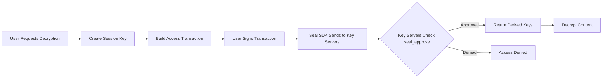

# Seal SDK Integration for Personal Data Wallet

## Overview

The Personal Data Wallet now uses Mysten's Seal SDK for privacy-preserving encryption with decentralized access control. This enables:

- **Owner-only decryption**: Only the data owner can decrypt their memories by default
- **Controlled sharing**: Owners can grant time-limited access to specific users
- **Audit trail**: All access attempts are logged on-chain
- **Decentralized security**: Uses threshold encryption across multiple key servers

## Architecture

### Components

1. **Seal Service** (`backend/src/infrastructure/seal/seal.service.ts`)
   - Handles encryption/decryption using Seal IBE
   - Manages session keys for authentication
   - Builds transactions for access control

2. **Access Control Contract** (`smart-contract/sources/seal_access_control.move`)
   - Manages ownership registry
   - Controls access permissions
   - Provides the `seal_approve` function for key servers

3. **Key Servers** (External)
   - Hold master secret keys
   - Evaluate access policies on-chain
   - Return derived keys when authorized

## How It Works

### 1. Encrypting Memory Content

When a user saves a memory:

```typescript
// User uploads memory
const { encryptedData, backupKey } = await sealService.encrypt(
  memoryContent,
  userAddress,
  { 
    memoryId: 'mem_123',
    timestamp: Date.now().toString()
  }
);

// Store encrypted data on Walrus
const blobId = await walrusService.upload(encryptedData);

// Register content ownership on-chain
await sealAccessControl.registerContent(memoryId);
```

**Important**: The `backupKey` can decrypt data independently and should be:
- Stored securely by the user
- Never shared or transmitted
- Used for recovery if needed

### 2. Owner Decryption

When the owner wants to read their memory:

```typescript
// Create session key
const sessionKey = await sealService.createSessionKey();

// Build access transaction
const tx = await sealService.buildAccessTransaction(
  userAddress,
  'read'
);

// User signs the transaction
const signedTxBytes = await userWallet.signTransaction(tx);

// Decrypt content
const decryptedContent = await sealService.decrypt(
  encryptedData,
  userAddress,
  sessionKey,
  signedTxBytes
);
```

### 3. Granting Access to Others

Owner can share specific memories:

```typescript
// Owner grants read access to another user
const grantTx = await sealService.grantAccess(
  ownerAddress,
  recipientAddress,
  memoryId,
  'read' // or 'write'
);

// Owner signs and executes transaction
await userWallet.signAndExecute(grantTx);
```

### 4. Third-Party Access

When a granted user wants to access shared memory:

```typescript
// Check if user has access
const hasAccess = await sealService.hasAccess(
  recipientAddress,
  memoryId,
  ownerAddress
);

if (hasAccess) {
  // Proceed with decryption using same flow as owner
  const sessionKey = await sealService.createSessionKey();
  const tx = await sealService.buildAccessTransaction(recipientAddress, 'read');
  // ... continue decryption
}
```

## Access Control Flow



## Permission Model

### Access Levels

1. **Owner**: Full access to all their encrypted content
2. **Read**: Can decrypt and view content
3. **Write**: Can decrypt, view, and modify content

### Time-Based Access

All granted permissions have expiration times:
- Default: 24 hours
- Configurable per grant
- Automatically enforced by smart contract

## Security Considerations

### 1. Threshold Configuration
- Uses 2-of-3 threshold by default
- If 1 key server is compromised, data remains secure
- If 2+ servers are available, decryption succeeds

### 2. Backup Key Management
- Each encryption generates a symmetric backup key
- Store backup keys in secure user-controlled storage
- Never transmit backup keys over network

### 3. Session Key Lifecycle
- Create new session keys per user session
- Export/import for persistence across app restarts
- Rotate regularly for enhanced security

### 4. Access Revocation
- Instant on-chain revocation
- Takes effect immediately
- Previously decrypted data remains with recipient

## Implementation Checklist

### Required Setup

1. **Deploy Access Control Contract**
   ```bash
   sui client publish --path smart-contract
   ```

2. **Configure Environment Variables**
   ```env
   SEAL_KEY_SERVER_IDS=0x...,0x...,0x...
   SEAL_PACKAGE_ID=<deployed_package_id>
   SEAL_MODULE_NAME=seal_access_control
   ```

3. **Initialize Key Servers**
   - Testnet: Use verified testnet servers
   - Mainnet: Choose from available providers

### API Endpoints

Implement these endpoints in your backend:

```typescript
// Encrypt memory
POST /api/memories/encrypt
{
  content: string,
  metadata?: Record<string, string>
}

// Decrypt memory
POST /api/memories/decrypt
{
  encryptedData: string,
  sessionKey: string,
  signedTx: string
}

// Grant access
POST /api/memories/:id/grant-access
{
  recipient: string,
  accessLevel: 'read' | 'write',
  expiresIn?: number
}

// Revoke access
POST /api/memories/:id/revoke-access
{
  recipient: string
}
```

## Migration from Crypto to Seal

### Before (using Node.js crypto):
```typescript
// Simple symmetric encryption
const encrypted = crypto.createCipheriv('aes-256-gcm', key, iv);
```

### After (using Seal SDK):
```typescript
// Identity-based encryption with access control
const { encryptedData } = await sealClient.encrypt({
  packageId,
  id: userAddress,
  data,
  threshold: 2
});
```

### Benefits:
- No key distribution problem
- Decentralized access control
- Audit trail on blockchain
- Threshold security
- Time-based permissions

## Troubleshooting

### Common Issues

1. **"No key servers configured"**
   - Set `SEAL_KEY_SERVER_IDS` environment variable
   - Use valid testnet/mainnet server object IDs

2. **"Access denied" during decryption**
   - Verify user has valid permissions
   - Check permission hasn't expired
   - Ensure transaction is properly signed

3. **"Package ID not found"**
   - Deploy access control contract first
   - Set correct `SEAL_PACKAGE_ID` in environment

## Resources

- [Seal SDK Documentation](https://seal-docs.wal.app/)
- [GitHub Repository](https://github.com/MystenLabs/seal)
- [TypeScript SDK Reference](https://sdk.mystenlabs.com/seal)
- [Key Server Providers](https://seal-docs.wal.app/Pricing/)