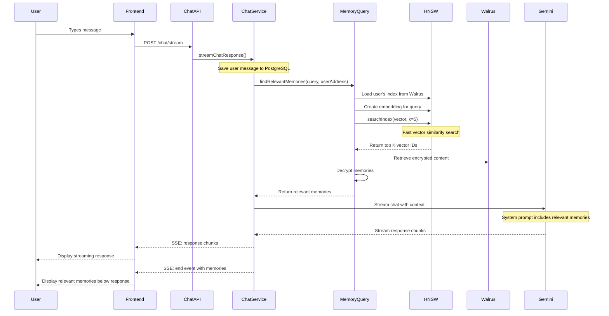

# Chat Memory Query Flow with HNSW Vector Search

## Overview

This document describes the complete query flow when a user sends a chat message, including how relevant memories are retrieved using HNSW (Hierarchical Navigable Small World) vector search and displayed in the frontend.

## Architecture Components

1. **Frontend (React/Next.js)**
   - Chat interface
   - Memory display component
   - SSE (Server-Sent Events) handler

2. **Backend (NestJS)**
   - Chat Controller
   - Chat Service
   - Memory Query Service
   - HNSW Index Service
   - Embedding Service

3. **Storage Systems**
   - **PostgreSQL**: Chat sessions and messages
   - **Walrus**: Encrypted memory content storage
   - **Sui Blockchain**: Memory metadata and indices
   - **HNSW Index**: Vector similarity search

## Detailed Query Flow



## Step-by-Step Process

### 1. User Input
```typescript
// User types: "What's my wife's birthday?"
```

### 2. Frontend Initiates Stream
```typescript
const response = await chatApi.streamChat({
  text: "What's my wife's birthday?",
  user_id: userAddress,
  session_id: currentSessionId,
  model: 'gemini-2.0-flash'
});
```

### 3. Backend Processing

#### a) Save User Message
```typescript
await this.chatMessageRepository.save({
  role: 'user',
  content: content,
  sessionId: dbSession.id,
  session: dbSession
});
```

#### b) HNSW Memory Search
```typescript
// 1. Create embedding for user query
const { vector } = await this.embeddingService.embedText(query);

// 2. Load HNSW index for user
const { index } = await this.hnswIndexService.loadIndex(indexBlobId, userAddress);

// 3. Perform fast vector search
const searchResults = this.hnswIndexService.searchIndex(index, vector, 5);
// Returns: { ids: [vectorId1, vectorId2, ...], distances: [0.92, 0.87, ...] }

// 4. Retrieve actual memory content (unencrypted)
for (const vectorId of searchResults.ids) {
  const content = await this.walrusService.retrieveContent(blobId);
  relevantMemories.push(content);
}
```

#### c) Generate AI Response with Context
```typescript
const systemPrompt = `
You are a helpful AI assistant with access to the user's personal memories.

Relevant memories from the user:
[Memory 1]: My wife Sarah's birthday is March 15th
[Memory 2]: We celebrated Sarah's 30th birthday last year
[Memory 3]: Sarah likes chocolate cake for her birthday

Please respond to the user's message in a helpful and informative way.
`;

const response = await gemini.generateContentStream(
  modelName,
  chatHistory,
  systemPrompt
);
```

### 4. Response Structure

The streaming response includes multiple event types:

#### Start Event
```json
{
  "type": "start",
  "intent": "CHAT"
}
```

#### Chunk Events (multiple)
```json
{
  "type": "chunk",
  "content": "Based on your memories, "
}
```

#### End Event with Memories
```json
{
  "type": "end",
  "content": "Based on your memories, your wife Sarah's birthday is March 15th. You celebrated her 30th birthday last year, and she enjoys chocolate cake for her birthday celebration.",
  "intent": "CHAT",
  "memoryStored": false,
  "memoryId": null,
  "memoryExtraction": null,
  "relevantMemories": [
    {
      "id": "mem-1",
      "content": "My wife Sarah's birthday is March 15th",
      "category": "personal",
      "timestamp": "2024-01-15T10:30:00Z",
      "isEncrypted": false,
      "owner": "0x123...",
      "similarity_score": 0.92,
      "walrusHash": "bafybeig..."
    },
    {
      "id": "mem-2",
      "content": "We celebrated Sarah's 30th birthday last year",
      "category": "personal",
      "timestamp": "2024-01-10T14:20:00Z",
      "isEncrypted": false,
      "owner": "0x123...",
      "similarity_score": 0.87,
      "walrusHash": "bafybeih..."
    }
  ]
}
```

### 5. Frontend Display

The frontend should handle the response to:

1. **Stream the AI response** in real-time
2. **Display relevant memories** below the response
3. **Show similarity scores** to indicate relevance
4. **Allow memory decryption** on-demand (if encrypted)

```jsx
// Example React component structure
<ChatMessage>
  <AIResponse>{streamedContent}</AIResponse>
  
  {relevantMemories.length > 0 && (
    <RelevantMemories>
      <h4>Related Memories:</h4>
      {relevantMemories.map(memory => (
        <MemoryCard
          key={memory.id}
          memory={memory}
          onDecrypt={() => decryptMemory(memory)}
          similarityScore={memory.similarity_score}
        />
      ))}
    </RelevantMemories>
  )}
</ChatMessage>
```

## Performance Characteristics

### HNSW Index Benefits
- **Fast Search**: O(log n) complexity for approximate nearest neighbor search
- **High Recall**: 95%+ recall rate with proper parameters
- **Scalable**: Handles millions of vectors efficiently
- **Memory Efficient**: Compressed index structure

### Query Performance
- **Embedding Generation**: ~50-100ms
- **HNSW Search**: ~10-50ms for 100k vectors
- **Memory Retrieval**: ~100-200ms per memory (parallel)
- **Total Latency**: ~300-500ms before streaming starts

## Security Considerations

1. **User Authentication**: All queries validate `userAddress`
2. **Access Control**: Users can only search their own memories
3. **Storage Security**: Memories stored in Walrus (decentralized storage)
4. **Future Enhancement**: Encryption will be added for production use

## Frontend Implementation Example

```typescript
// Frontend SSE handler
const eventSource = new EventSource(streamUrl);
let fullResponse = '';
let relevantMemories = [];

eventSource.onmessage = (event) => {
  const data = JSON.parse(event.data);
  
  switch (data.type) {
    case 'start':
      setIsStreaming(true);
      break;
      
    case 'chunk':
      fullResponse += data.content;
      setResponse(fullResponse);
      break;
      
    case 'end':
      setResponse(data.content);
      setRelevantMemories(data.relevantMemories || []);
      setIsStreaming(false);
      eventSource.close();
      break;
      
    case 'error':
      handleError(data.message);
      eventSource.close();
      break;
  }
};
```

## Best Practices

1. **Limit Memory Results**: Return top 5-10 most relevant memories
2. **Similarity Threshold**: Only show memories with >0.7 similarity
3. **Category Filtering**: Allow filtering by memory category
4. **Lazy Decryption**: Decrypt memories only when user requests
5. **Cache Embeddings**: Cache frequently accessed memory embeddings
6. **Index Updates**: Rebuild HNSW index periodically as memories grow

## Future Enhancements

1. **Temporal Relevance**: Weight recent memories higher
2. **Multi-Modal Search**: Support image/audio memories
3. **Semantic Clustering**: Group related memories
4. **Privacy Controls**: Fine-grained memory sharing
5. **Federated Search**: Search across shared memory pools
