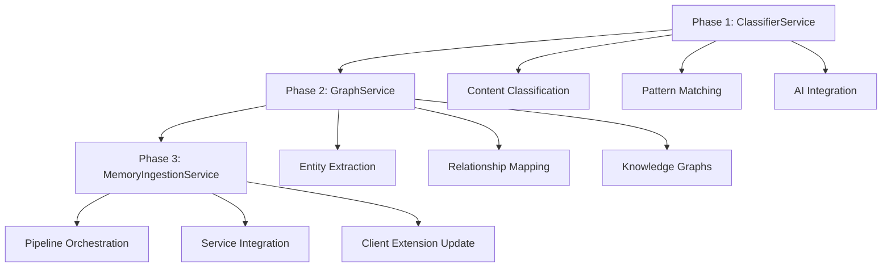

# PDW-SDK Advanced Services Implementation Plan

## Executive Summary

This comprehensive plan addresses the implementation of three critical missing services in the PDW-SDK package: **MemoryIngestionService**, **ClassifierService**, and **GraphService**. These services will provide advanced memory processing capabilities, bringing the SDK to feature parity with the backend while maintaining clean architecture principles.

**Objective**: Implement advanced memory processing services following existing SDK patterns and backend service functionality.

**Timeline**: 3-week implementation across 3 phases with incremental testing and validation.

**Success Criteria**: Complete service integration with PersonalDataWallet client extension, comprehensive test coverage, and production-ready implementations.

---

## Current State Analysis

### ✅ **Existing PDW-SDK Services (11 total)**
```
services/
├── BatchService.ts        ✅ Batch transaction operations  
├── EmbeddingService.ts    ✅ Vector embedding generation
├── EncryptionService.ts   ✅ Encryption/decryption operations
├── MemoryIndexService.ts  ✅ Memory indexing with HNSW wrapper
├── MemoryService.ts       ✅ Core memory operations (CRUD)
├── QueryService.ts        ✅ Advanced multi-strategy search
├── StorageService.ts      ✅ Walrus storage operations
├── TransactionService.ts  ✅ Sui blockchain transactions
├── VectorService.ts       ✅ Vector operations and utilities
├── ViewService.ts         ✅ Blockchain view calls
└── index.ts              ✅ Clean exports with documentation
```

### ❌ **Missing Services (Backend Comparison)**

| Service | Backend Lines | Primary Function | Priority |
|---------|---------------|------------------|----------|
| **MemoryIngestionService** | 819 | Main orchestrator for memory processing pipeline | **High** |
| **ClassifierService** | 234 | Content classification and filtering | **Medium** |
| **GraphService** | 305 | Entity/relationship extraction | **Medium** |

### **Service Coverage Analysis**
- **✅ Core Storage & Retrieval**: 100% coverage
- **✅ Vector Operations**: 100% coverage  
- **✅ Blockchain Integration**: 100% coverage
- **✅ Encryption/Security**: 100% coverage
- **❌ Advanced Processing**: 40% coverage (missing ingestion, classification, graphs)
- **❌ Content Analysis**: 20% coverage (missing summarization, classification)

---

## Implementation Strategy

### **3-Phase Progressive Implementation**



### **Dependency Flow**
- **Phase 1 (ClassifierService)**: Independent - establishes AI integration patterns
- **Phase 2 (GraphService)**: Builds on Phase 1 AI patterns  
- **Phase 3 (MemoryIngestionService)**: Orchestrates Phase 1 & 2 services

---

## Phase 1: ClassifierService Implementation

### **Timeline**: Week 1 (Days 1-5)
### **Priority**: Medium (Foundation for advanced processing)

### **Service Specification**

```typescript
// src/services/ClassifierService.ts
export interface ClassificationResult {
  shouldSave: boolean;
  confidence: number;
  category: string;
  reasoning: string;
}

export interface ClassificationOptions {
  useAI?: boolean;
  confidenceThreshold?: number;
  categories?: string[];
}

export class ClassifierService {
  constructor(
    private embeddingService?: EmbeddingService,
    private aiApiKey?: string
  ) {}

  // Core Methods
  async shouldSaveMemory(message: string, options?: ClassificationOptions): Promise<ClassificationResult>
  async classifyContent(content: string, options?: ClassificationOptions): Promise<string>
  async analyzePatterns(text: string): Promise<{patterns: string[], categories: string[]}>
  
  // Utility Methods
  private matchPatterns(text: string): {matched: boolean, category: string, confidence: number}
  private aiClassify(text: string): Promise<ClassificationResult>
}
```

### **Core Functionality**

1. **Pattern-Based Classification**
   - Port regex patterns from backend (personal info, preferences, explicit requests)
   - Category mapping: `personal_info`, `contact`, `preference`, `education`, `career`, `custom`
   - Confidence scoring based on pattern matches

2. **AI-Enhanced Classification**
   - Fallback to EmbeddingService or external AI API
   - Gemini/OpenAI integration for complex content analysis
   - Confidence threshold validation

3. **Integration Points**
   - Import into `services/index.ts`
   - Add to PersonalDataWallet client extension as `pdw.classify.*`
   - Integration with existing MemoryService

### **Backend Code Adaptation**

**From Backend (234 lines):**
```typescript
// Remove NestJS dependencies
- import { Injectable, Logger } from '@nestjs/common';
- import { GeminiService } from '../../infrastructure/gemini/gemini.service';

// Add SDK dependencies  
+ import { EmbeddingService } from './EmbeddingService';
+ import type { ClientWithCoreApi, PDWConfig } from '../types';
```

**Pattern Categories to Port:**
- Personal information: name, email, location, work, background
- Preferences: likes, dislikes, favorites, interests  
- Explicit requests: "remember that", "don't forget"
- Personal facts: identity, possessions, education

### **Testing Requirements**
- **Pattern Matching Tests**: All regex patterns with positive/negative cases
- **AI Integration Tests**: Mock AI responses and error handling
- **Confidence Scoring Tests**: Threshold validation and edge cases
- **Integration Tests**: MemoryService integration and client extension

---

## Phase 2: GraphService Implementation  

### **Timeline**: Week 1-2 (Days 6-10)
### **Priority**: Medium (Knowledge graph functionality)

### **Service Specification**

```typescript
// src/services/GraphService.ts
export interface Entity {
  id: string;
  label: string;
  type: string;
}

export interface Relationship {
  source: string;
  target: string;
  label: string;
}

export interface KnowledgeGraph {
  entities: Entity[];
  relationships: Relationship[];
}

export interface GraphExtractionOptions {
  useAI?: boolean;
  entityTypes?: string[];
  maxEntities?: number;
  confidenceThreshold?: number;
}

export class GraphService {
  constructor(
    private embeddingService?: EmbeddingService,
    private storageService?: StorageService,
    private aiApiKey?: string
  ) {}

  // Core Methods
  async extractEntitiesAndRelationships(text: string, options?: GraphExtractionOptions): Promise<{entities: Entity[], relationships: Relationship[]}>
  async createGraph(): KnowledgeGraph
  async addToGraph(graph: KnowledgeGraph, entities: Entity[], relationships: Relationship[]): KnowledgeGraph
  async persistGraph(graph: KnowledgeGraph, graphId: string): Promise<string>
  async retrieveGraph(graphId: string): Promise<KnowledgeGraph>
  
  // Utility Methods
  private sanitizeId(id: string): string
  private validateGraph(graph: KnowledgeGraph): boolean
  private aiExtractGraph(text: string): Promise<{entities: Entity[], relationships: Relationship[]}>
}
```

### **Core Functionality**

1. **Entity/Relationship Extraction**
   - AI-powered text analysis for entity identification
   - Relationship mapping between extracted entities
   - Entity types: person, concept, organization, location, event

2. **Knowledge Graph Management**
   - Graph creation, validation, and manipulation
   - Entity ID sanitization and uniqueness
   - Relationship validation and consistency

3. **Persistence Integration**
   - Store graphs using StorageService (Walrus)
   - Metadata tagging for graph search and retrieval
   - Version management for graph updates

### **Backend Code Adaptation**

**From Backend (305 lines):**
```typescript
// Remove backend dependencies
- import { WalrusService } from '../../infrastructure/walrus/walrus.service';
- import { GeminiService } from '../../infrastructure/gemini/gemini.service';

// Add SDK dependencies
+ import { StorageService } from './StorageService';
+ import { EmbeddingService } from './EmbeddingService';
+ import type { ClientWithCoreApi, PDWConfig } from '../types';
```

**AI Integration Patterns:**
- Prompt engineering for entity/relationship extraction
- JSON response parsing and validation
- Error handling for malformed AI responses
- Fallback mechanisms for AI service failures

### **Testing Requirements**
- **Entity Extraction Tests**: Text analysis with known entities
- **Relationship Mapping Tests**: Complex relationship scenarios
- **Graph Operations Tests**: Create, add, validate, persist, retrieve
- **AI Integration Tests**: Mock responses and error scenarios
- **Storage Integration Tests**: Walrus persistence and retrieval

---

## Phase 3: MemoryIngestionService Implementation

### **Timeline**: Week 2-3 (Days 11-21)
### **Priority**: High (Main orchestrator service)

### **Service Specification**

```typescript
// src/services/MemoryIngestionService.ts
export interface CreateMemoryDto {
  content: string;
  category: string;
  userAddress: string;
  userSignature?: string;
  topic?: string;
  importance?: number;
}

export interface EnhancedCreateMemoryDto extends CreateMemoryDto {
  topic: string;
  importance: number;
  customMetadata?: Record<string, string>;
}

export interface ProcessMemoryDto {
  content: string;
  userAddress: string;
  category?: string;
}

export interface MemoryProcessingResult {
  memoryId: string;
  classification: ClassificationResult;
  entities?: Entity[];
  relationships?: Relationship[];
  embeddings: number[];
  metadata: Record<string, any>;
  processingTime: number;
}

export class MemoryIngestionService {
  constructor(
    private client: ClientWithCoreApi,
    private config: PDWConfig,
    private classifierService: ClassifierService,
    private graphService: GraphService,
    private embeddingService: EmbeddingService,
    private memoryService: MemoryService,
    private storageService: StorageService
  ) {}

  // Main Pipeline Methods
  async createMemory(dto: CreateMemoryDto): Promise<MemoryProcessingResult>
  async processMemory(dto: ProcessMemoryDto): Promise<MemoryProcessingResult>
  async enhanceMemory(dto: EnhancedCreateMemoryDto): Promise<MemoryProcessingResult>
  
  // Pipeline Steps
  private async classifyContent(content: string): Promise<ClassificationResult>
  private async extractGraphData(content: string): Promise<{entities: Entity[], relationships: Relationship[]}>
  private async generateEmbeddings(content: string): Promise<number[]>
  private async buildMetadata(dto: any, classification: ClassificationResult, graphData?: any): Promise<Record<string, any>>
  private async persistMemory(data: any): Promise<string>
}
```

### **Core Functionality**

1. **Pipeline Orchestration**
   - Coordinate ClassifierService, GraphService, EmbeddingService
   - Sequential processing with error handling and rollback
   - Performance monitoring and optimization

2. **Memory Enhancement**
   - Content classification and filtering
   - Entity/relationship extraction
   - Embedding generation and indexing
   - Metadata enrichment

3. **Integration Management**
   - Service dependency injection
   - Configuration management
   - Error propagation and recovery
   - Transaction coordination

### **Backend Code Adaptation**

**From Backend (819 lines):**
```typescript
// Remove NestJS dependencies
- import { Injectable, Logger } from '@nestjs/common';
- import { ConfigService } from '@nestjs/config';

// Add SDK dependencies
+ import type { ClientWithCoreApi, PDWConfig } from '../types';
+ import { ClassifierService } from './ClassifierService';
+ import { GraphService } from './GraphService';
```

**Pipeline Coordination:**
- Classification → Entity Extraction → Embedding → Storage
- Error handling at each step with rollback capabilities
- Performance monitoring and logging
- Batch processing support integration

### **Testing Requirements**
- **Pipeline Integration Tests**: Full end-to-end memory processing
- **Service Coordination Tests**: Mock service interactions
- **Error Handling Tests**: Failure scenarios and recovery
- **Performance Tests**: Large content processing and batch operations
- **Client Extension Tests**: PersonalDataWallet integration

---

## PersonalDataWallet Integration Plan

### **Client Extension Updates**

```typescript
// src/client/PersonalDataWallet.ts - API Extensions

export interface PersonalDataWalletExtension {
  // Existing APIs
  createMemory: (options: MemoryCreateOptions) => Promise<string>;
  searchMemories: (options: MemorySearchOptions) => Promise<MemorySearchResult[]>;
  
  // NEW: Classification APIs  
  classify: {
    shouldSave: (content: string, options?: ClassificationOptions) => Promise<ClassificationResult>;
    content: (content: string, options?: ClassificationOptions) => Promise<string>;
    patterns: (text: string) => Promise<{patterns: string[], categories: string[]}>;
  };
  
  // NEW: Graph APIs
  graph: {
    extract: (text: string, options?: GraphExtractionOptions) => Promise<{entities: Entity[], relationships: Relationship[]}>;
    create: () => KnowledgeGraph;
    persist: (graph: KnowledgeGraph, graphId: string) => Promise<string>;
    retrieve: (graphId: string) => Promise<KnowledgeGraph>;
  };
  
  // NEW: Advanced Ingestion APIs
  ingest: {
    process: (dto: ProcessMemoryDto) => Promise<MemoryProcessingResult>;
    enhance: (dto: EnhancedCreateMemoryDto) => Promise<MemoryProcessingResult>;
    create: (dto: CreateMemoryDto) => Promise<MemoryProcessingResult>;
  };
}
```

### **Service Registration**

```typescript
// Update PersonalDataWallet constructor
export class PersonalDataWallet {
  // Existing services
  private memoryService: MemoryService;
  private storageService: StorageService;
  private embeddingService: EmbeddingService;
  
  // NEW services
  private classifierService: ClassifierService;
  private graphService: GraphService;  
  private memoryIngestionService: MemoryIngestionService;
  
  constructor(client: ClientWithCoreApi, config: PDWConfig) {
    // Initialize new services
    this.classifierService = new ClassifierService(this.embeddingService, config.aiApiKey);
    this.graphService = new GraphService(this.embeddingService, this.storageService, config.aiApiKey);
    this.memoryIngestionService = new MemoryIngestionService(
      client, config, this.classifierService, this.graphService, 
      this.embeddingService, this.memoryService, this.storageService
    );
  }
}
```

---

## Testing Strategy

### **Phase 1: ClassifierService Testing**
- **Unit Tests**: Pattern matching, confidence scoring, AI integration
- **Integration Tests**: EmbeddingService integration, client extension
- **Performance Tests**: Large content classification
- **AI Integration Tests**: Mock AI responses, error handling

### **Phase 2: GraphService Testing**  
- **Unit Tests**: Entity extraction, relationship mapping, graph operations
- **Integration Tests**: StorageService persistence, AI integration
- **Performance Tests**: Large text processing, complex graphs
- **Validation Tests**: Graph consistency, entity uniqueness

### **Phase 3: MemoryIngestionService Testing**
- **Pipeline Tests**: Full end-to-end memory processing
- **Integration Tests**: All service coordination
- **Performance Tests**: Batch processing, large content
- **Error Handling Tests**: Service failure scenarios
- **Client Extension Tests**: PersonalDataWallet API integration

### **Comprehensive Testing Requirements**
- **Test Coverage Target**: >90% for all new services
- **Performance Target**: <5 seconds for typical memory processing
- **Reliability Target**: <1% flaky test rate
- **Integration Target**: All PersonalDataWallet APIs working

---

## Timeline and Milestones

### **Week 1: Foundation Services**
**Days 1-3: ClassifierService Implementation**
- ✅ Service class creation with pattern matching
- ✅ AI integration with EmbeddingService  
- ✅ Comprehensive unit tests (15-20 test cases)
- ✅ Integration with services/index.ts

**Days 4-5: ClassifierService Integration**
- ✅ PersonalDataWallet client extension updates
- ✅ End-to-end testing with existing MemoryService
- ✅ Performance optimization and error handling

**Days 6-7: GraphService Implementation Start**
- ✅ Service class creation with entity extraction
- ✅ AI integration patterns established
- ✅ Basic graph operations and validation

### **Week 2: Advanced Services**
**Days 8-10: GraphService Completion**
- ✅ Complete entity/relationship extraction
- ✅ StorageService integration for persistence
- ✅ Comprehensive unit tests (20-25 test cases)
- ✅ PersonalDataWallet graph API integration

**Days 11-14: MemoryIngestionService Implementation**
- ✅ Service orchestration framework
- ✅ Pipeline coordination with all services
- ✅ Error handling and rollback mechanisms
- ✅ Performance monitoring and optimization

### **Week 3: Integration and Validation**
**Days 15-17: MemoryIngestionService Completion**
- ✅ Complete pipeline testing and validation  
- ✅ PersonalDataWallet ingest API integration
- ✅ Performance testing and optimization
- ✅ Comprehensive error handling

**Days 18-21: Final Integration and Testing**
- ✅ End-to-end integration testing
- ✅ Performance benchmarking across all services
- ✅ Documentation updates and examples
- ✅ Production readiness validation

### **Milestones**
- **Week 1 End**: ClassifierService production-ready, GraphService foundation
- **Week 2 End**: All three services implemented and tested
- **Week 3 End**: Complete integration with PersonalDataWallet, production-ready

---

## Risk Management

### **Technical Risks**

1. **AI Service Integration Complexity**
   - **Risk**: External AI API dependencies and rate limiting
   - **Mitigation**: Implement robust fallback mechanisms, caching, and error handling
   - **Fallback**: Use EmbeddingService for simpler classification, pattern-only matching

2. **Service Coordination Complexity**
   - **Risk**: Complex interdependencies between services in MemoryIngestionService
   - **Mitigation**: Incremental integration, comprehensive error handling, transaction rollback
   - **Testing**: Extensive integration testing with mock failure scenarios

3. **Performance Impact**
   - **Risk**: Pipeline processing may be slow with multiple AI calls
   - **Mitigation**: Implement caching, batch processing, parallel operations where possible
   - **Monitoring**: Performance benchmarking and optimization at each phase

4. **Configuration Management**
   - **Risk**: Complex configuration for multiple AI services and integration points
   - **Mitigation**: Clear configuration patterns, validation, and defaults
   - **Documentation**: Comprehensive setup guides and examples

### **Integration Risks**

1. **PersonalDataWallet API Consistency**
   - **Risk**: New APIs may not align with existing patterns
   - **Mitigation**: Follow established patterns, comprehensive API design review
   - **Validation**: Extensive client extension testing

2. **Backward Compatibility**
   - **Risk**: New services may break existing functionality
   - **Mitigation**: Non-breaking additions, comprehensive regression testing
   - **Testing**: Full test suite execution with new services

### **Quality Risks**

1. **Test Coverage and Reliability**
   - **Risk**: Complex services may have inadequate test coverage
   - **Mitigation**: >90% test coverage target, comprehensive test planning
   - **Quality Gates**: Codacy analysis, build validation, performance testing

2. **AI Response Quality**
   - **Risk**: Inconsistent or poor-quality AI responses affecting service reliability
   - **Mitigation**: Response validation, confidence thresholds, fallback mechanisms
   - **Testing**: Extensive AI response testing with edge cases

---

## Success Criteria

### **Functional Success Criteria**
- ✅ All three services (ClassifierService, GraphService, MemoryIngestionService) implemented and tested
- ✅ PersonalDataWallet client extension updated with new APIs (`pdw.classify.*`, `pdw.graph.*`, `pdw.ingest.*`)
- ✅ Complete integration with existing services (MemoryService, StorageService, EmbeddingService)
- ✅ End-to-end memory processing pipeline working (content → classification → graph extraction → embedding → storage)

### **Quality Success Criteria**
- ✅ >90% test coverage for all new services
- ✅ <1% flaky test rate across all test suites
- ✅ Zero TypeScript compilation errors
- ✅ Codacy analysis with zero critical issues
- ✅ All existing tests continue to pass (regression-free)

### **Performance Success Criteria**
- ✅ <5 seconds typical memory processing time
- ✅ <30 seconds for complex content with full pipeline processing
- ✅ Batch processing support for multiple memories
- ✅ Efficient AI API usage with caching and rate limiting

### **Integration Success Criteria**
- ✅ PersonalDataWallet APIs working: `pdw.classify.shouldSave()`, `pdw.graph.extract()`, `pdw.ingest.process()`
- ✅ Service coordination working: MemoryIngestionService orchestrating all services
- ✅ Error handling working: Graceful fallbacks and error recovery
- ✅ Configuration management: Clear setup and validation

### **Documentation Success Criteria**
- ✅ Complete API documentation for all new services
- ✅ Integration examples and usage patterns
- ✅ Configuration guides and troubleshooting
- ✅ Updated README and architecture documentation

---

## Next Steps

### **Immediate Actions (Day 1)**
1. **Create ClassifierService skeleton** in `src/services/ClassifierService.ts`
2. **Set up testing framework** for new services
3. **Review backend code** for detailed implementation patterns
4. **Update services/index.ts** with new service exports

### **Week 1 Priorities**
1. **ClassifierService implementation** with pattern matching and AI integration
2. **GraphService foundation** with entity extraction framework
3. **Testing infrastructure** for all new services
4. **PersonalDataWallet updates** for initial API integration

### **Success Validation**
- After each phase, run comprehensive tests and validate integration
- Use Codacy analysis for code quality validation
- Performance benchmark each service independently and integrated
- Validate PersonalDataWallet APIs with real-world usage scenarios

---

**Implementation Status**: Ready to begin Phase 1 (ClassifierService)  
**Foundation**: Clean architecture with 11 consolidated services provides excellent foundation  
**Readiness**: StorageService consolidation complete, all prerequisites satisfied